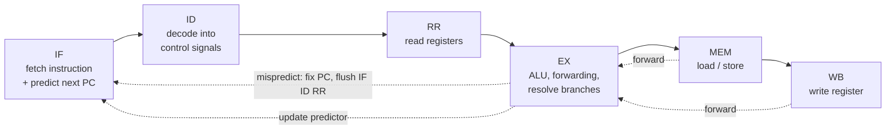
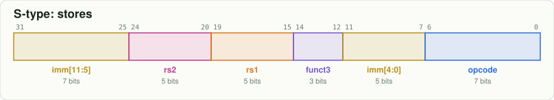
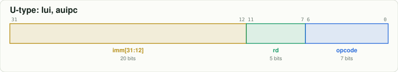
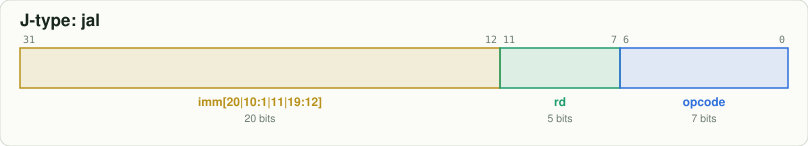
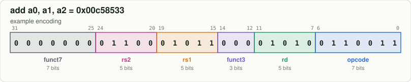
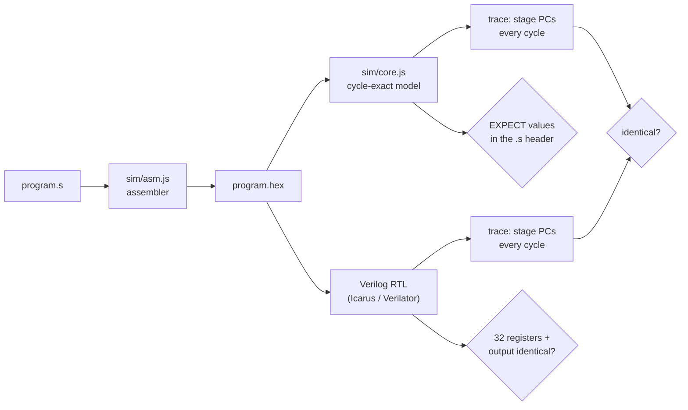

# rv64-6stage: a 64-bit RISC-V CPU you can watch think

A complete, readable **6-stage pipelined RV64IM processor** in Verilog, with a **gshare branch
predictor**, a cycle-exact software twin, an **interactive browser simulator**, every instruction
documented **in binary**, and a regression suite that proves the Verilog and the simulator agree
on every clock cycle.


| | |
|---|---|
| **ISA** | RV64I + M (65 instructions: integer, 32-bit "W" ops, multiply, divide) |
| **Pipeline** | IF · ID · RR · EX · MEM · WB, in-order, single-issue |
| **Hazards** | full forwarding (EX/MEM, MEM/WB, register-file bypass), 1-cycle load-use stall |
| **Branch prediction** | gshare (256 x 2-bit counters, 8-bit global history) + 32-entry branch target buffer |
| **Verified** | 13 programs x 2 predictor modes, RTL == model on **every cycle**; 845 instruction tests against an independent reference |
| **Runs on** | Icarus Verilog, Verilator, any browser; Yosys for synthesis |

**Contents:** [Quick start](#quick-start) · [Interactive simulator](#interactive-simulator) ·
[The six stages](#the-six-stages) · [Instructions in binary](#instructions-in-binary) ·
[Hazards](#hazards) · [Branch prediction](#branch-prediction-gshare) ·
[The math](#the-math-verified) · [Verification](#how-we-know-it-works) ·
[Silicon](#down-to-silicon) · [Real-world cores](#how-it-compares-to-real-cores) ·
[Experiments](#experiments) · [Commands](#every-command) · [Publish to GitHub](#publish-to-github) ·
[References](#references)

---

## Quick start

Tested on Ubuntu (including Ubuntu under Windows Subsystem for Linux 2, WSL2).

```bash
# 1. tools
sudo apt update
sudo apt install -y git make nodejs npm iverilog verilator gtkwave yosys graphviz librsvg2-bin python3

# 2. get the code
git clone https://github.com/<your-user>/rv64-6stage.git
cd rv64-6stage

# 3. prove it works: every program on the model AND the Verilog, cycle by cycle
make test

# 4. look inside
make pipe PROG=03_load_use        # pipeline chart in the terminal
make run  PROG=09_primes_sieve    # run a program, see registers and statistics
make serve                        # then open http://localhost:8000/web/
```

Node.js 18 or newer is needed (for BigInt and ES modules): check with `node --version`.
Nothing is installed with npm; the JavaScript has no dependencies.

Expected output of `make test` (abridged):

```
PASS gshare programs/05_fibonacci.s      316 cycles, CPI 1.04,    2 redirects | RTL ✓ cycle-exact
PASS no-bp  programs/05_fibonacci.s      463 cycles, CPI 1.52,   51 redirects | RTL ✓ cycle-exact
PASS gshare programs/09_primes_sieve.s 17134 cycles, CPI 1.15,  420 redirects | RTL ✓ cycle-exact
...
26 passed, 0 failed
```

---

## Interactive simulator

`make serve` and open http://localhost:8000/web/ (or the GitHub Pages link, once published).
Pick a program and press **Step**:

* the six stages, with each instruction sliding forward on every clock
* a narrated explanation of what every stage did this cycle
* the pipeline chart, with stalls hatched, flushed instructions greyed, forwarded operands ringed
* the listing with each instruction's **binary encoding colour-coded by field**; click one to split it into fields
* all 32 registers, with the one written this cycle highlighted
* the gshare predictor live: the 256 counters as a heat map, the global history bits, the BTB
* CPI, stalls, mispredictions, accuracy, and a check of the cycle equation when the program halts
* an editor: write your own assembly and run it

It runs `sim/core.js`, the same model the Verilog is tested against, so what you see is what the
hardware does.

---

## The six stages



| stage | does | key hardware | file |
|---|---|---|---|
| **IF** | fetch the 32-bit instruction at PC, guess the next PC | PC register, instruction memory, gshare + BTB | `rv64_core.v`, `branch_predictor.v` |
| **ID** | turn bits into control signals and an immediate | decoder, immediate generator | `decoder.v`, `imm_gen.v` |
| **RR** | read up to two source registers | 32 x 64-bit register file | `regfile.v` |
| **EX** | compute, forward operands, resolve branches | ALU, forward muxes, branch unit | `alu.v`, `forward_unit.v`, `branch_unit.v` |
| **MEM** | access data memory | 64 KiB byte-addressed memory | `memory.v` |
| **WB** | write the result to `rd` | register file write port | `regfile.v` |

Why six and not the textbook five? Decode and register read get separate stages, like the CVA6
core **[11]**: less logic per stage allows a faster clock, at the cost of a 3-cycle (instead of
2-cycle) misprediction penalty. [MATH.md](docs/MATH.md) works through the trade-off.

A program flowing through, straight from the model:


Deep dive: **[docs/ARCHITECTURE.md](docs/ARCHITECTURE.md)** (every pipeline register field,
the control table, the exact hazard rules).

---

## Instructions in binary

Every instruction is 32 bits. The register fields sit in the **same bit positions** in every
format, so the register file can be read before decoding finishes:

| | |
|---|---|
|  |  |
|  |  |
|  |  |

A concrete one:



**[binary/](binary/README.md)** has a page for each of the 65 instructions: bit pattern, an
example encoding, the control signals the decoder sets, and what happens to it in each of the
six stages. There is also an [opcode map](binary/opcode_map.md) and every example program
[assembled to binary](binary/programs/).

From the terminal:

```bash
$ node tools/rv.mjs encode "sd ra, 8(sp)"
sd ra, 8(sp)    [Store Doubleword, S-type, RV64I]
  hex     0x00113423
  binary  0000000 00001 00010 011 01000 0100011
          imm[11:5]                [31:25]  0000000
          rs2                      [24:20]  00001
          rs1                      [19:15]  00010
          funct3                   [14:12]  011
          imm[4:0]                 [11: 7]  01000
          opcode                   [ 6: 0]  0100011
  meaning M[rs1 + sext(imm)][63:0] = rs2

$ node tools/rv.mjs decode 00c58533
$ node tools/rv.mjs isa                     # table of all 65
```

---

## Hazards

**Data hazards are forwarded.** A chain of dependent instructions runs with zero stalls; rings
mark operands taken from a pipeline register instead of the register file:


**Load-use costs one cycle**, because a load's data exists only at the end of MEM. Hatched cells
are the stall; the second half of the program does the same work reordered, with no stalls:


**Control hazards** are handled by prediction (next section). A wrong guess flushes the 3
instructions behind the branch.

---

## Branch prediction: gshare

```
 index = PC[9:2] XOR GHR[7:0]          GHR = outcomes of the last 8 branches
 predict taken  <=>  BTB hit AND (jump OR counter[index] >= 2)
```

gshare **[7]** XORs global history into the table index, so the *same* branch uses *different*
2-bit counters **[5]** depending on what the previous branches did. That lets it learn patterns a
single counter cannot. After training, a branch that alternates taken / not-taken runs with no
flushes at all:


Measured (all "none" and "gshare" rows are also confirmed on the RTL):

| program | no prediction | bimodal (no history) | **gshare** |
|---|---|---|---|
| 11_gshare_patterns (alternating branch) | CPI 2.09, 20% | CPI 1.56, 59% | **CPI 1.04, 97.4%** |
| 09_primes_sieve | CPI 1.74, 44% | CPI 1.11, 97% | CPI 1.15, 93% |
| 05_fibonacci | CPI 1.52, 50% | CPI 1.04, 98% | CPI 1.04, 98% |
| 04_branch_penalty (10-iteration loop) | CPI 1.97, 10% | CPI 1.33, 80% | CPI 2.06, 0% |

(percent = correctly predicted branches and jumps)

gshare is not always best: on short simple loops its history spreads one branch across many
untrained counters. [MATH.md §5c](docs/MATH.md) derives all 10 of its mispredictions on the
10-iteration loop by hand. That weakness is exactly why McFarling proposed combining predictors,
and it is one of the labs.

```bash
make bp PROG=11_gshare_patterns       # compare predictors on any program
make run PROG=09_primes_sieve BP=0    # turn the predictor off
```

---

## The math, verified

For this pipeline, for every program:

```
 cycles  =  N  +  5  +  L  +  3M        N = instructions, L = load-use stalls, M = mispredictions
 CPI     =  1  +  5/N  +  L/N  +  3M/N
```

It is derived from counting empty write-back slots, and `make math` checks it exactly against
all 26 program/predictor runs. [docs/MATH.md](docs/MATH.md) covers the Iron Law, clock period and
logic depth, forwarding, the load-use proof, the 3-cycle penalty, the 2-bit counter state
machine, gshare indexing, worked examples, and speed-ups (sieve: 1.50x from prediction), each
with references to the literature.

---

## How we know it works



1. **Cycle-exact co-simulation.** For every program, with the predictor on and off, the RTL and
   the model must produce the same pipeline contents on every cycle, the same final registers and
   the same printed output.
2. **Independent expected values.** Each program declares its answer (`# EXPECT: a0 = 21`).
   `tests/isa_selfcheck.s` runs **845 checks covering every instruction** including division by
   zero, overflow and sign extension, with expected values computed by a separate Python
   reference implementation, not by either model.
3. **The tests catch real bugs.** Breaking `sra` in the ALU, or disabling the load-use stall,
   makes `make test` fail with the exact register or the first diverging cycle.
4. **Lint clean** under `verilator --lint-only -Wall`.

---

## Down to silicon

`make synth` synthesizes the core with Yosys. The pipeline control is under 1% of the logic;
the single-cycle 64-bit multiply/divide is most of it:


`make schematics` draws the control units as actual gates; this is the entire load-use hazard
detector:


[docs/SILICON.md](docs/SILICON.md) goes from RTL to gates to standard cells to layout, and links
to die photos and floorplans of real RISC-V chips.

---

## How it compares to real cores

| core | pipeline | issue | branch prediction | silicon |
|---|---|---|---|---|
| **this repo** | 6 stages, in-order | 1 | gshare 256 + BTB 32 | simulation, Yosys synthesis |
| **CVA6 (Ariane)** [11][12] | 6 stages, in-order, RV64 | 1 | branch history table + BTB + return address stack | GF 22FDX, 3 mm x 3 mm die, up to 1.7 GHz |
| **Rocket** [15] | 5 stages, in-order, RV64 | 1 | BHT + BTB + RAS | many Berkeley test chips |
| **SiFive U74** | 8 stages, in-order, RV64GC | 2 | yes | StarFive JH7110 (VisionFive 2 board) |
| **BOOM** [13][14] | out-of-order, RV64 | 2-4 | TAGE-style | BROOM, TSMC 28 nm |

The design here is deliberately the smallest thing that still has every *kind* of hazard and a
real predictor. CVA6 is the best next step: same depth and width, plus caches, virtual memory,
and privilege modes.

---

## Experiments

| # | program | teaches |
|---|---|---|
| 00 | `pipeline_fill` | latency vs throughput |
| 01 | `hello` | memory-mapped I/O, a load-use stall per character |
| 02 | `forwarding` | dependent chain with zero stalls |
| 03 | `load_use` | the unavoidable stall, and scheduling around it |
| 04 | `branch_penalty` | 3-cycle penalty, gshare warm-up |
| 05 | `fibonacci` | 64-bit arithmetic, prediction speed-up |
| 06 | `bubble_sort` | realistic mix, data-dependent branches |
| 07 | `factorial_recursive` | call/ret, stack, `jalr` prediction |
| 08 | `gcd_euclid` | `rem` |
| 09 | `primes_sieve` | the benchmark: 14,841 instructions |
| 10 | `print_numbers` | `divu`/`remu`, decimal output |
| 11 | `gshare_patterns` | correlated branches, where history wins |

Plus seven hardware labs (resize the predictor, build a tournament predictor, speculative
history, multi-cycle divider, remove forwarding, early jumps, your own programs) in
**[docs/EXPERIMENTS.md](docs/EXPERIMENTS.md)**, and waveform viewing with GTKWave
(`make wave PROG=03_load_use` opens a pre-arranged stage-by-stage view).

---

## Every command

| command | does |
|---|---|
| `make test` | full regression, RTL vs model, predictor on and off |
| `make test-model` | regression without Verilog tools |
| `make math` | verify the cycle equation on every program |
| `make run PROG=x [BP=0]` | run on the model |
| `make pipe PROG=x` | terminal pipeline chart |
| `make cycle PROG=x C=n` | explain one clock cycle |
| `make bp PROG=x` | compare none / bimodal / gshare |
| `make rtl PROG=x [BP=0]` | run on the Verilog (Icarus), writes a trace |
| `make vsim PROG=x` | run on Verilator (compiled, fast) |
| `make wave PROG=x` | VCD + GTKWave |
| `make lint` | Verilator lint, all warnings |
| `make docs` | regenerate `binary/`, all SVGs, the web program bundle |
| `make schematics` | Yosys gate schematics |
| `make synth` | Yosys synthesis, gate budget chart |
| `make serve` | browser simulator on port 8000 |
| `node tools/rv.mjs encode "..."` / `decode <hex>` / `isa` | instruction encoding tools |

## Repository layout

```
rtl/            Verilog: core, predictor, decoder, ALU, register file, hazard/forward units, memory
tb/             testbench: clock, reset, per-cycle trace, register dump, VCD
sim/            isa.js (the ISA table), asm.js (assembler), core.js (cycle-exact model)
tools/          rv.mjs (CLI), test.mjs, verify_math.mjs, gendocs.mjs, blockdiagram.mjs, synth.ys
programs/       the experiments (each with EXPECT lines)
tests/          isa_selfcheck.s: 845 generated checks of every instruction
web/            the browser simulator (static files, no build step)
binary/         generated: every instruction in binary, opcode map, assembled programs
docs/           ARCHITECTURE, MATH, EXPERIMENTS, SILICON, REFERENCES, images, GTKWave view
```

---

## Publish to GitHub

Replace `<your-user>` below. If your machine uses a dedicated SSH host alias for this account
(for example an entry in `~/.ssh/config`), use that alias in place of `github.com` in the remote URL.

```bash
cd rv64-6stage
make test && make docs                       # everything green and regenerated

git init -b main                             # skip if already a repository
git add .
git commit -m "RV64IM 6-stage pipeline with gshare, cycle-exact model, docs and simulator"

# create the empty repo on GitHub first (web UI), or with the GitHub CLI:
gh repo create <your-user>/rv64-6stage --public --source . --remote origin

# push over SSH (needed to push .github/workflows if your HTTPS token lacks the "workflow" scope)
git remote set-url origin git@github.com:<your-user>/rv64-6stage.git
git push -u origin main
```

Turn on the live simulator: GitHub, **Settings → Pages → Build and deployment → Deploy from a
branch → `main` / `/ (root)` → Save**. After a minute it is at
`https://<your-user>.github.io/rv64-6stage/` (the root page forwards to `web/`).

The included workflow (`.github/workflows/ci.yml`) runs lint and the full regression on every push.

---

## References

Full list with links in **[docs/REFERENCES.md](docs/REFERENCES.md)**. The main ones:

* **[1]** RISC-V ISA Manual, Vol. I Unprivileged: https://github.com/riscv/riscv-isa-manual
* **[2]** Patterson and Hennessy, *Computer Organization and Design, RISC-V Edition*, 2nd ed., ch. 4
* **[3]** Hennessy and Patterson, *Computer Architecture: A Quantitative Approach*, 6th ed., ch. 3, App. C
* **[5]** J. E. Smith, "A Study of Branch Prediction Strategies," ISCA 1981
* **[7]** S. McFarling, "Combining Branch Predictors," DEC WRL TN-36, 1993 (gshare)
* **[11]** Zaruba and Benini, IEEE TVLSI 2019: CVA6/Ariane, a 6-stage RV64 core in silicon
* **[16]** MIT 6.004 Computation Structures (OpenCourseWare) · **[18]** MIT 6.175

## License

MIT, see [LICENSE](LICENSE).
