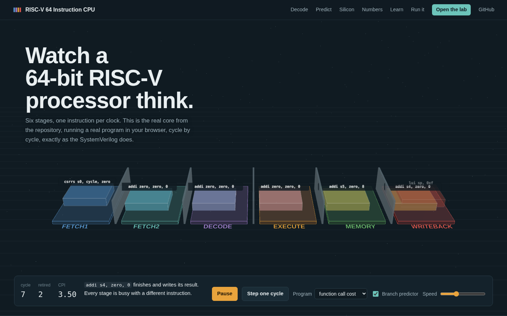
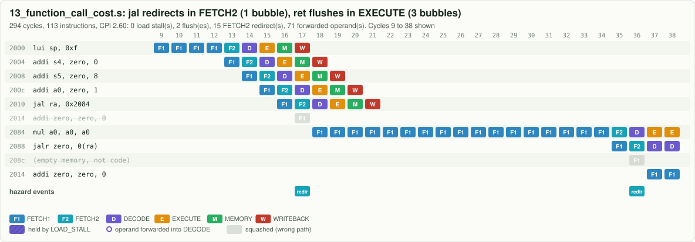
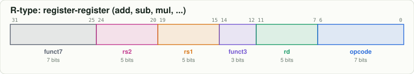
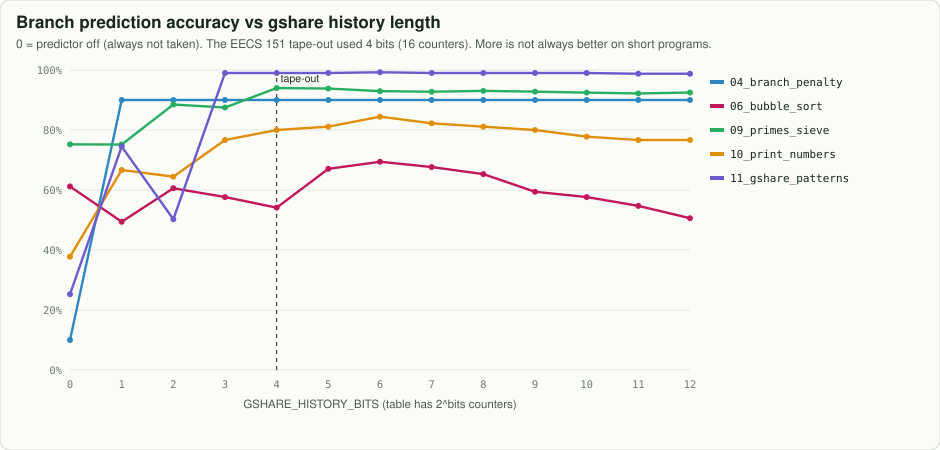
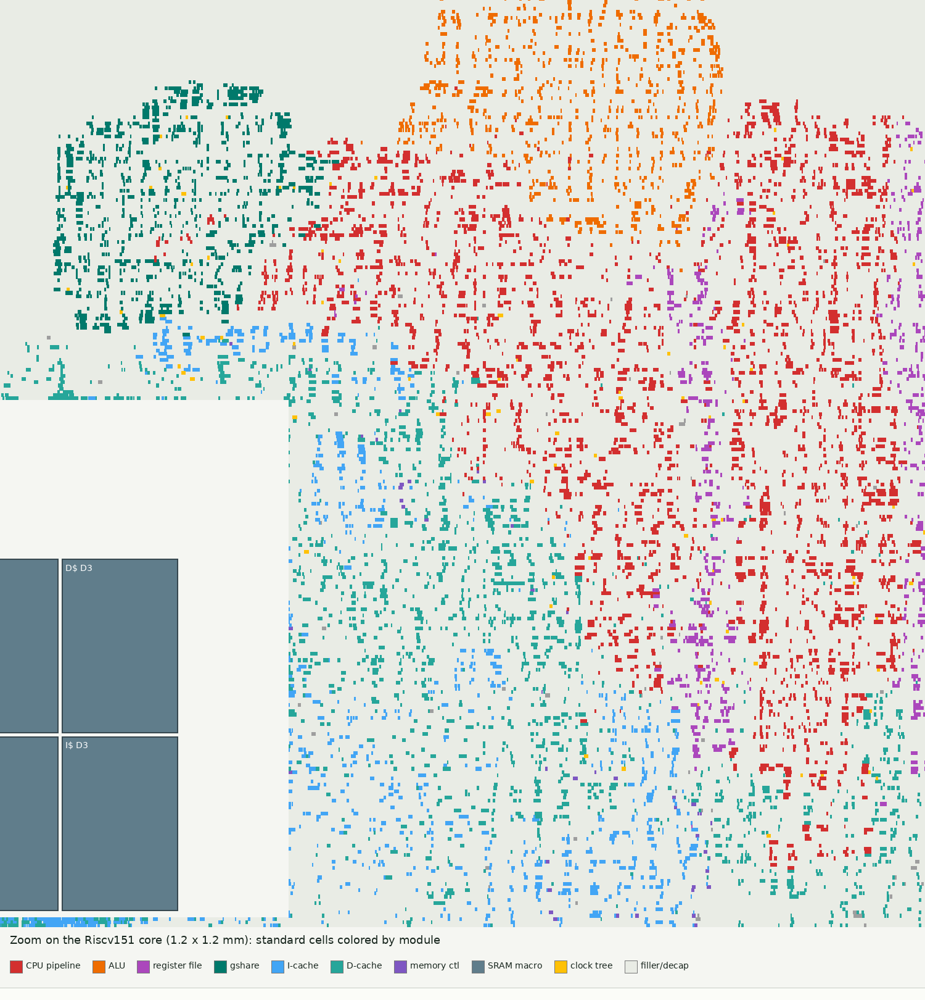
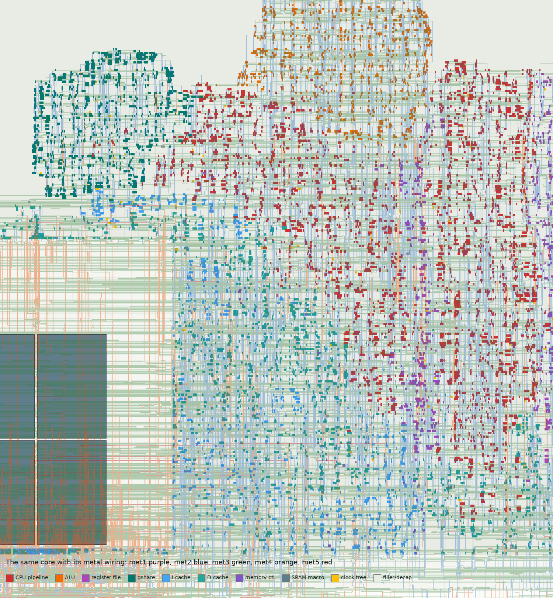

# RISC-V 64 Instruction CPU

**A 64-bit RISC-V processor you can read, run, watch, and see as real silicon.** A 6-stage pipelined
RV64IM core with a gshare branch predictor, written in SystemVerilog in the style of the EECS 151
(UC Berkeley, Spring 2026) ASIC project it grew from, and built to **teach how a RISC-V CPU works and
how to read its diagrams**.


| | |
|---|---|
| **Instruction set** | RV64I + M (multiply/divide) + Zicsr (CSR instructions): 71 instructions, every one documented [in binary](binary/README.md) |
| **Pipeline** | FETCH1 → FETCH2 → DECODE → EXECUTE → MEMORY → WRITEBACK, in order, one instruction per cycle |
| **Hazards** | forwarding into DECODE from EXECUTE / MEMORY / WRITEBACK, 1-cycle `LOAD_STALL` |
| **Branch prediction** | `GSharePredictor`: 16 two-bit counters indexed by PC xor global history, with checkpoint repair; JAL and predicted-taken branches redirect in FETCH2 |
| **Verified** | 15 programs + an 859-case self-checking test, predictor on and off: the RTL matches a software twin on **every clock cycle** |
| **Silicon** | the original design's real sky130 layout, timing and area, plus sky130 synthesis of this RTL |
| **Runs on** | Icarus Verilog, Verilator, Yosys, any web browser |

## Open the live site

[](https://normansrule.github.io/riscv-64-instruction-cpu/)

The [GitHub Pages site](https://normansrule.github.io/riscv-64-instruction-cpu/) runs everything in
your browser, with no install:

* **the CPU in 3D**: every die is a real instruction moving through the six stages, with
  forwarding arcs, stalls and flushes as they happen;
* **a bit playground**: flip any of the 32 bits and watch the decoder and its control signals change;
* **a predictor race**: the same program with and without gshare, at any history length;
* **a chip scope**: pan and zoom the real placed-and-routed layout and peel the metal off with a slider;
* **a live dashboard** of where every cycle goes, for every program;
* **the lab** ([`web/`](web/index.html)): step forward and back through any program, or your own.

Or start with the [learning path](docs/learn/README.md) (8 short chapters) and the
[architecture reference](docs/ARCHITECTURE.md).

---

## Quick start (Ubuntu or WSL)

```bash
sudo apt-get install -y nodejs iverilog verilator yosys graphviz gtkwave make git curl unzip
git clone <this repository> && cd riscv-64-instruction-cpu

make test                          # every program on the RTL and the model, compared cycle by cycle
make run  PROG=05_fibonacci        # registers, cycles, CPI, predictor accuracy
make pipe PROG=03_load_use         # a pipeline chart in your terminal
make cycle PROG=03_load_use C=5    # everything that happens in clock cycle 5
make serve                         # then open http://localhost:8000/ (the site) or /web/ (the lab)
```

## Watch it run

The [web simulator](web/index.html) runs the same cycle-exact model the RTL is tested against. Step
forward and back through a program and see every stage, every forwarded operand, the gshare counters
and history, the binary encoding and control signals of each instruction, and the running CPI.



**How to read a pipeline chart:** rows are instructions, columns are clock cycles, each box is the
stage the instruction is in. Rings are forwarded operands, hatched boxes are held by a load stall,
grey crossed-out rows were fetched down a wrong path and squashed. Above: a `jal` squashes one
instruction (FETCH2 redirect), a `ret` squashes three (EXECUTE flush).

## Learn it: eight chapters

| | chapter | picture you will be able to read |
|---|---|---|
| 1 | [What a CPU does](docs/learn/01_what_is_a_cpu.md) | the pipeline staircase |
| 2 | [Instructions are just 32 bits](docs/learn/02_instructions_in_binary.md) | instruction format diagrams |
| 3 | [The six stages and how to read the diagrams](docs/learn/03_the_six_stages.md) | the block diagram above |
| 4 | [Data hazards: forwarding and load stalls](docs/learn/04_data_hazards.md) | forwarding and stall charts |
| 5 | [Control hazards and branch prediction](docs/learn/05_branch_prediction.md) | the 2-bit counter and gshare |
| 6 | [Measuring performance](docs/learn/06_performance.md) | the CPI stack |
| 7 | [From RTL to silicon](docs/learn/07_silicon.md) | a chip layout, a timing path |
| 8 | [Using the CPU: write your own program](docs/learn/08_using_the_cpu.md) | your own program's pipeline |

## Instructions in binary



Every instruction has a page in [`binary/`](binary/README.md) with its bit pattern, an example
encoding, the exact control signals `ControlUnit` produces for it, and its journey through the six
stages. Try `node tools/rv.mjs encode "ld a0, 16(sp)"`.

## Branch prediction



The tape-out used 4 history bits (16 counters). The sweep shows why the "right" size depends on the
program, and [SILICON.md](docs/SILICON.md#this-repositorys-64-bit-rtl-on-sky130) shows the price:
the predictor's area grows about 4x for every 2 extra bits.

## Where every cycle goes


The model tags every bubble with its cause, so `cycles = N + 5 + L + 3F + R` holds **exactly** for
every program ([MATH.md](docs/MATH.md), checked by `make math`).

| program | what it shows | cycles (gshare) | CPI | cycles (predictor off) | CPI |
|---|---|---:|---:|---:|---:|
| [`00_pipeline_fill`](programs/00_pipeline_fill.s) | watch an empty pipeline fill up | 10 | 2.00 | 10 | 2.00 |
| [`01_hello`](programs/01_hello.s) | print a string through memory-mapped I/O | 139 | 1.43 | 136 | 1.40 |
| [`02_forwarding`](programs/02_forwarding.s) | a chain of dependent instructions with ZERO stalls | 12 | 1.71 | 12 | 1.71 |
| [`03_load_use`](programs/03_load_use.s) | the one data hazard forwarding cannot fix | 18 | 1.64 | 18 | 1.64 |
| [`04_branch_penalty`](programs/04_branch_penalty.s) | what a branch costs in this 6-stage pipe | 50 | 1.52 | 65 | 1.97 |
| [`05_fibonacci`](programs/05_fibonacci.s) | iterative Fibonacci, fib(50) in a 64-bit register | 366 | 1.20 | 363 | 1.19 |
| [`06_bubble_sort`](programs/06_bubble_sort.s) | sort 10 signed 64-bit numbers in memory | 1124 | 1.56 | 1069 | 1.48 |
| [`07_factorial_recursive`](programs/07_factorial_recursive.s) | recursion, the stack, CALL and RET | 327 | 1.39 | 324 | 1.37 |
| [`08_gcd_euclid`](programs/08_gcd_euclid.s) | greatest common divisor with REM (M extension) | 33 | 1.74 | 30 | 1.58 |
| [`09_primes_sieve`](programs/09_primes_sieve.s) | Sieve of Eratosthenes | 19773 | 1.33 | 20897 | 1.41 |
| [`10_print_numbers`](programs/10_print_numbers.s) | print Fibonacci numbers in decimal using DIVU/REMU | 737 | 1.37 | 804 | 1.49 |
| [`11_gshare_patterns`](programs/11_gshare_patterns.s) | a branch that ALTERNATES taken / not-taken | 1519 | 1.38 | 2106 | 1.91 |
| [`12_measure_cpi`](programs/12_measure_cpi.s) | a program that measures its OWN performance | 122 | 1.28 | 157 | 1.65 |
| [`13_function_call_cost`](programs/13_function_call_cost.s) | why function calls are not free on this pipeline | 166 | 1.52 | 188 | 1.72 |
| [`14_false_load_stall`](programs/14_false_load_stall.s) | a stall caused by bits that only LOOK like a register | 25 | 1.32 | 25 | 1.32 |

## Down to silicon

| | |
|---|---|
|  |  |

The original EECS 151 design as placed and routed on SkyWater sky130: register file in purple,
pipeline in red, ALU in orange, gshare in teal, then the metal wiring layer by layer. 26 ns clock,
+0.163 ns slack, 15,753 cells. More than half the clock period is the ALU's ripple-carry adder:


Real sky130 transistor layouts of the gates it is made of (XOR for the gshare index, a flip-flop for
the pipeline registers): [SILICON.md](docs/SILICON.md).

## How we know it works

* `make test`: every program runs on the SystemVerilog RTL (Icarus Verilog) **and** on
  [`model/core.js`](model/core.js). Their per-cycle traces (what is in each of the six stages), the
  cycle count, the output, `tohost` and all 32 registers must match exactly, with the predictor on
  and off. `# EXPECT:` lines in each program are checked too.
* [`tests/isa_selfcheck.s`](tests/isa_selfcheck.s): 859 generated test cases whose expected values
  come from an independent Python reference ([`tools/gen_selfcheck.py`](tools/gen_selfcheck.py)).
  It reports through the `tohost` CSR the way riscv-tests do.
* `make lint`: Verilator with all warnings (except the naming style this code uses on purpose).
* Continuous integration runs all of it on every push ([`.github/workflows/ci.yml`](.github/workflows/ci.yml)).

## Experiments

Ten labs in [EXPERIMENTS.md](docs/EXPERIMENTS.md): history length, counter reset values, a
multi-cycle divider, removing false load stalls, a return address stack, a branch target buffer, a
faster adder for the critical path, forwarding into EXECUTE, and putting the caches back.

## Repository map

| path | contents |
|---|---|
| [`src/`](src) | the SystemVerilog RTL: `Riscv64.sv` and one file per module ([file list](src/sources.f)) |
| [`tb/`](tb) | the testbench (per-cycle trace, register dump, `+BP=0` to disable prediction) |
| [`model/`](model) | ISA table, assembler, cycle-exact pipeline model (JavaScript) |
| [`programs/`](programs), [`tests/`](tests) | example programs and the self-check |
| [`binary/`](binary/README.md) | every instruction and every program in binary |
| [`docs/`](docs) | [learning path](docs/learn/README.md), [architecture](docs/ARCHITECTURE.md), [math](docs/MATH.md), [experiments](docs/EXPERIMENTS.md), [silicon](docs/SILICON.md), [from EECS 151](docs/FROM_EECS151.md), [references](docs/REFERENCES.md) |
| [`index.html`](index.html), [`site/`](site) | the GitHub Pages front page: 3D pipeline, bit playground, predictor race, chip scope, dashboard (vanilla JavaScript modules + vendored three.js, no build step) |
| [`web/`](web/index.html) | the pipeline lab: step-by-step simulator |
| [`tools/`](tools) | CLI, test runner, doc/chart/diagram generators, chip and cell renderers |
| [`original/eecs151-rv32i/`](original/eecs151-rv32i) | the student-written RV32I original, its physical-design configs, final DEF and reports |

## Every command

```text
make test / test-model / math        verification
make run / pipe / cycle / bp         explore a program     (PROG=..., BP=0, HIST=6)
make rtl / vsim / wave               run on Icarus, Verilator, or open GTKWave
make docs / charts / diagram         regenerate generated pages and pictures
make synth / schematics              sky130 synthesis per module, Yosys schematics
make lint / serve / clean
```

## Publish the site

```bash
cd ~/riscv-64-instruction-cpu && git push           # the site is plain static files
# GitHub: Settings -> Pages -> Build and deployment -> Deploy from a branch -> main, / (root) -> Save
# about a minute later: https://<your-user>.github.io/riscv-64-instruction-cpu/
```

The front page was inspired by interactive explainers such as bbycroft's llm-viz and Georgia Tech's
Transformer Explainer; the 3D view uses three.js (MIT, vendored in `site/vendor/`).

## Credits and license

Designed by Aleksander Norman. The RTL is grown from his EECS 151/251A ASIC project (UC Berkeley,
Spring 2026); course-staff files are not included. SkyWater sky130 cell layouts are Apache-2.0.
Everything else is under the [MIT license](LICENSE).
