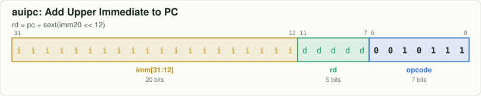
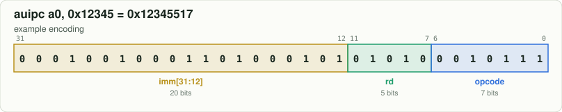

# `auipc` — Add Upper Immediate to PC

[← all instructions](../README.md) · extension **RV64I** · format **U** · category *Upper immediate*

```
rd = pc + sext(imm20 << 12)
```

## Encoding



```
bit:  31                              0
      iiii iiii iiii iiii iiii dddd d001 0111
```

Fixed bits are `0`/`1`. Letters are filled in by the assembler:
`d` = rd, `s` = rs1, `t` = rs2, `i` = immediate, `h` = shift amount, `f` = funct3, `m/p/u` = fence fields.

## Example

`auipc a0, 0x12345` assembles to **`0x12345517`** = `00010010001101000101010100010111`



| field | bits | template | example |
|---|---|---|---|
| `imm[31:12]` | 31:12 | `iiiiiiiiiiiiiiiiiiii` | `00010010001101000101` |
| `rd` | 11:7 | `ddddd` | `01010` |
| `opcode` | 6:0 | `0010111` | `0010111` |

Try it yourself:

```bash
node tools/rv.mjs encode "auipc a0, 0x12345"
node tools/rv.mjs decode 12345517
```

## Control signals set by the decoder (`rtl/decoder.v`)

| signal | value | | signal | value |
|---|---|---|---|---|
| `use_rs1` | 0 | | `is_load` | 0 |
| `use_rs2` | 0 | | `is_store` | 0 |
| `reg_write` | 1 (if rd≠x0) | | `is_branch` | 0 |
| `alu_op` | ADD | | `is_jal` / `is_jalr` | 0 / 0 |
| `a_sel` | PC | | `wb_pc4` | 0 |
| `b_imm` | 1 | | `is_halt` | 0 |
| `is_word` | 0 | | | |

## Journey through the 6-stage pipeline

| stage | what happens to `auipc` |
|---|---|
| **IF** | Fetch the 32-bit word at `PC` from instruction memory; predict not-taken: `PC ← PC + 4`. |
| **ID** | Decoder recognises `auipc` from opcode `0010111`; the immediate generator builds the U-type immediate. |
| **RR** | Nothing to read: this instruction has no register sources. |
| **EX** | ALU computes `PC + imm` (A input selects PC). |
| **MEM** | No memory access: the result passes through to MEM/WB. |
| **WB** | Write `rd` ← ALU result. |
