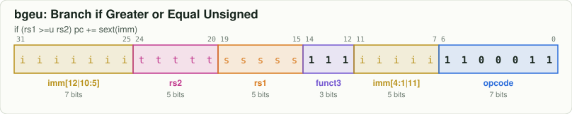
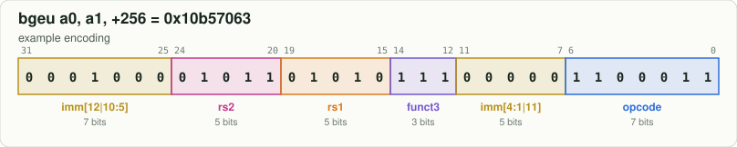

# `bgeu`: Branch if Greater or Equal Unsigned

[← all instructions](../README.md) · extension **RV64I** · format **B** · category *Branch*

```
if (rs1 >=u rs2) pc += sext(imm)
```

## Encoding



```
bit:  31                              0
      iiii iiit tttt ssss s111 iiii i110 0011
```

Fixed bits are `0`/`1`. Letters are filled in by the assembler:
`d` = rd, `s` = rs1, `t` = rs2, `i` = immediate, `h` = shift amount, `c` = CSR address, `z` = 5-bit CSR immediate, `f` = funct3, `m/p/u` = fence fields.

## Example

`bgeu a0, a1, +256` assembles to **`0x10b57063`** = `00010000101101010111000001100011`



| field | bits | template | example |
|---|---|---|---|
| `imm[12|10:5]` | 31:25 | `iiiiiii` | `0001000` |
| `rs2` | 24:20 | `ttttt` | `01011` |
| `rs1` | 19:15 | `sssss` | `01010` |
| `funct3` | 14:12 | `111` | `111` |
| `imm[4:1|11]` | 11:7 | `iiiii` | `00000` |
| `opcode` | 6:0 | `1100011` | `1100011` |

Try it yourself:

```bash
node tools/rv.mjs encode "bgeu a0, a1, 256"   # use a label or a number for the offset
node tools/rv.mjs decode 10b57063
```

## Control signals from the Control Unit ([`src/Control_Unit.sv`](../../src/Control_Unit.sv))

These are the exact values the RTL produces for the example word above (computed by the
bit-exact twin in `model/core.js`, which `make test` checks against the RTL every cycle).

| signal | value | | signal | value |
|---|---|---|---|---|
| `REGISTER_WRITE_ENABLE` | `0` | | `IS_A_MULTIPLY_DIVIDE_INSTRUCTION` | `0` |
| `MEMORY_READ_ENABLE` | `0` | | `IS_A_BRANCH_INSTRUCTION` | `1` |
| `MEMORY_WRITE_ENABLE` | `0` | | `IS_A_JAL_INSTRUCTION` | `0` |
| `CSR_WRITE_ENABLE` | `0` | | `IS_A_JALR_INSTRUCTION` | `0` |
| `CSR_WRITE_USING_IMMEDIATE` | `0` | | `IMMEDIATE_TYPE_SELECT` | `IMMEDIATE_B` |
| `ALU_INPUT_A_IS_PC` | `1` | | `WRITEBACK_SELECT` | `WRITEBACK_ALU` |
| `ALU_INPUT_B_IS_IMMEDIATE` | `1` | | `ALU_OPERATION` | `ALU_ADD` |
| `ALU_IS_WORD_OPERATION` | `0` | |  |  |

## Journey through the 6-stage pipeline

| stage | what happens to `bgeu` |
|---|---|
| **FETCH1** | The PC is sent to the instruction memory. At the same time the **GSharePredictor** reads the 2-bit counter at `PC[5:2] XOR GLOBAL_HISTORY_REGISTER` (it does not know yet what instruction this is). |
| **FETCH2** | The 32-bit word arrives. Opcode `1100011` = branch: the B-immediate is unscrambled and `FETCH2_PC_TARGET = PC + imm` is precomputed. If the counter said **taken**, FETCH1 is redirected to the target and the instruction fetched behind the branch is squashed (1 bubble). The predicted direction is shifted into the global history. |
| **DECODE** | **ControlUnit** + **ALUdec** recognise `bgeu` from opcode `1100011`, funct3 `111`; the **ImmediateGenerator** builds the B-type immediate. The **RegisterFile** is read for `rs1` and `rs2`, and the forwarding muxes replace a stale value with a newer one from EXECUTE, MEMORY or WRITEBACK. |
| **EXECUTE** | **BranchComparator** checks `(rs1 >=u rs2)`. **BranchControl** compares that with the prediction: right -> nothing happens; wrong -> `FLUSH_FETCH1_FETCH2_DECODE` squashes 3 instructions and FETCH1 restarts at the correct address. The gshare counter is trained either way. |
| **MEMORY** | No memory work. **WriteControl** picks the result value. |
| **WRITEBACK** | Nothing to write. The instruction retires (`instret` + 1). |

See the whole datapath in the [block diagram](../../docs/ARCHITECTURE.md) and step through a program in the [web simulator](../../web/index.html).
