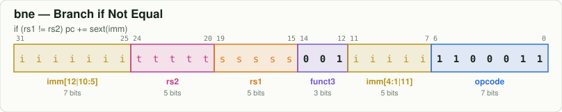
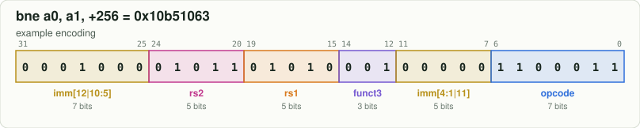

# `bne` — Branch if Not Equal

[← all instructions](../README.md) · extension **RV64I** · format **B** · category *Branch*

```
if (rs1 != rs2) pc += sext(imm)
```

## Encoding



```
bit:  31                              0
      iiii iiit tttt ssss s001 iiii i110 0011
```

Fixed bits are `0`/`1`. Letters are filled in by the assembler:
`d` = rd, `s` = rs1, `t` = rs2, `i` = immediate, `h` = shift amount, `f` = funct3, `m/p/u` = fence fields.

## Example

`bne a0, a1, +256` assembles to **`0x10b51063`** = `00010000101101010001000001100011`



| field | bits | template | example |
|---|---|---|---|
| `imm[12|10:5]` | 31:25 | `iiiiiii` | `0001000` |
| `rs2` | 24:20 | `ttttt` | `01011` |
| `rs1` | 19:15 | `sssss` | `01010` |
| `funct3` | 14:12 | `001` | `001` |
| `imm[4:1|11]` | 11:7 | `iiiii` | `00000` |
| `opcode` | 6:0 | `1100011` | `1100011` |

Try it yourself:

```bash
node tools/rv.mjs encode "bne a0, a1, 256"   # use a label or a number for the offset
node tools/rv.mjs decode 10b51063
```

## Control signals set by the decoder (`rtl/decoder.v`)

| signal | value | | signal | value |
|---|---|---|---|---|
| `use_rs1` | 1 | | `is_load` | 0 |
| `use_rs2` | 1 | | `is_store` | 0 |
| `reg_write` | 0 | | `is_branch` | 1 |
| `alu_op` | — (unused) | | `is_jal` / `is_jalr` | 0 / 0 |
| `a_sel` | RS1 | | `wb_pc4` | 0 |
| `b_imm` | 0 | | `is_halt` | 0 |
| `is_word` | 0 | | | |

## Journey through the 6-stage pipeline

| stage | what happens to `bne` |
|---|---|
| **IF** | Fetch the 32-bit word at `PC` from instruction memory; predict not-taken: `PC ← PC + 4`. |
| **ID** | Decoder recognises `bne` from opcode `1100011`, funct3 `001`; the immediate generator builds the B-type immediate. |
| **RR** | Read `rs1` and `rs2` from the register file (write-first bypass if WB is writing the same register). |
| **EX** | Branch unit compares `rs1` and `rs2` ((rs1 != rs2)); target = `PC + imm`. If taken, redirect PC and flush IF/ID/RR (3-cycle penalty). Operands may be replaced by forwarded values from EX/MEM or MEM/WB. |
| **MEM** | No memory access: the result passes through to MEM/WB. |
| **WB** | Nothing is written. |
