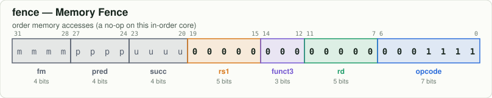
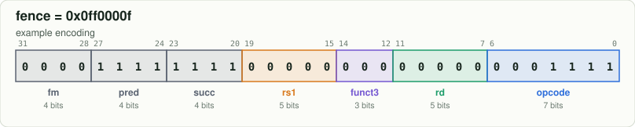

# `fence` — Memory Fence

[← all instructions](../README.md) · extension **RV64I** · format **FENCE** · category *System*

```
order memory accesses (a no-op on this in-order core)
```

## Encoding



```
bit:  31                              0
      mmmm pppp uuuu 0000 0000 0000 0000 1111
```

Fixed bits are `0`/`1`. Letters are filled in by the assembler:
`d` = rd, `s` = rs1, `t` = rs2, `i` = immediate, `h` = shift amount, `f` = funct3, `m/p/u` = fence fields.

## Example

`fence` assembles to **`0x0ff0000f`** = `00001111111100000000000000001111`



| field | bits | template | example |
|---|---|---|---|
| `fm` | 31:28 | `mmmm` | `0000` |
| `pred` | 27:24 | `pppp` | `1111` |
| `succ` | 23:20 | `uuuu` | `1111` |
| `rs1` | 19:15 | `00000` | `00000` |
| `funct3` | 14:12 | `000` | `000` |
| `rd` | 11:7 | `00000` | `00000` |
| `opcode` | 6:0 | `0001111` | `0001111` |

Try it yourself:

```bash
node tools/rv.mjs encode "fence"
node tools/rv.mjs decode 0ff0000f
```

## Control signals set by the decoder (`rtl/decoder.v`)

| signal | value | | signal | value |
|---|---|---|---|---|
| `use_rs1` | 0 | | `is_load` | 0 |
| `use_rs2` | 0 | | `is_store` | 0 |
| `reg_write` | 0 | | `is_branch` | 0 |
| `alu_op` | — (unused) | | `is_jal` / `is_jalr` | 0 / 0 |
| `a_sel` | RS1 | | `wb_pc4` | 0 |
| `b_imm` | 0 | | `is_halt` | 0 |
| `is_word` | 0 | | | |

## Journey through the 6-stage pipeline

| stage | what happens to `fence` |
|---|---|
| **IF** | Fetch the 32-bit word at `PC` from instruction memory; predict not-taken: `PC ← PC + 4`. |
| **ID** | Decoder recognises `fence` from opcode `0001111`, funct3 `000`; the immediate generator builds the FENCE-type immediate. |
| **RR** | Nothing to read: this instruction has no register sources. |
| **EX** | Nothing (FENCE is a no-op on an in-order core with one memory). |
| **MEM** | No memory access: the result passes through to MEM/WB. |
| **WB** | Nothing is written. |
