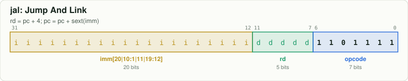
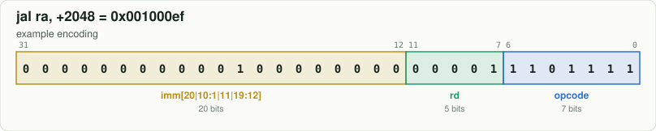

# `jal` — Jump And Link

[← all instructions](../README.md) · extension **RV64I** · format **J** · category *Jump*

```
rd = pc + 4; pc = pc + sext(imm)
```

## Encoding



```
bit:  31                              0
      iiii iiii iiii iiii iiii dddd d110 1111
```

Fixed bits are `0`/`1`. Letters are filled in by the assembler:
`d` = rd, `s` = rs1, `t` = rs2, `i` = immediate, `h` = shift amount, `f` = funct3, `m/p/u` = fence fields.

## Example

`jal ra, +2048` assembles to **`0x001000ef`** = `00000000000100000000000011101111`



| field | bits | template | example |
|---|---|---|---|
| `imm[20|10:1|11|19:12]` | 31:12 | `iiiiiiiiiiiiiiiiiiii` | `00000000000100000000` |
| `rd` | 11:7 | `ddddd` | `00001` |
| `opcode` | 6:0 | `1101111` | `1101111` |

Try it yourself:

```bash
node tools/rv.mjs encode "jal ra, 2048"   # use a label or a number for the offset
node tools/rv.mjs decode 001000ef
```

## Control signals set by the decoder (`rtl/decoder.v`)

| signal | value | | signal | value |
|---|---|---|---|---|
| `use_rs1` | 0 | | `is_load` | 0 |
| `use_rs2` | 0 | | `is_store` | 0 |
| `reg_write` | 1 (if rd≠x0) | | `is_branch` | 0 |
| `alu_op` | — (unused) | | `is_jal` / `is_jalr` | 1 / 0 |
| `a_sel` | RS1 | | `wb_pc4` | 1 |
| `b_imm` | 0 | | `is_halt` | 0 |
| `is_word` | 0 | | | |

## Journey through the 6-stage pipeline

| stage | what happens to `jal` |
|---|---|
| **IF** | Fetch the 32-bit word at `PC` from instruction memory; predict not-taken: `PC ← PC + 4`. |
| **ID** | Decoder recognises `jal` from opcode `1101111`; the immediate generator builds the J-type immediate. |
| **RR** | Nothing to read: this instruction has no register sources. |
| **EX** | Target `PC + imm`: always redirect and flush IF/ID/RR. The link value `PC + 4` is sent down the pipe. |
| **MEM** | No memory access: the result passes through to MEM/WB. |
| **WB** | Write `rd` ← `PC + 4`. |
