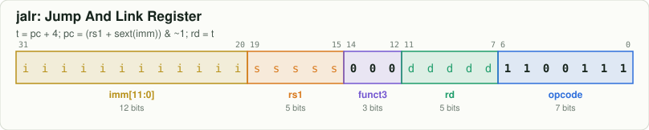
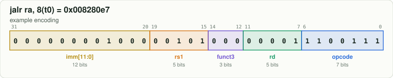

# `jalr` — Jump And Link Register

[← all instructions](../README.md) · extension **RV64I** · format **I** · category *Jump*

```
t = pc + 4; pc = (rs1 + sext(imm)) & ~1; rd = t
```

## Encoding



```
bit:  31                              0
      iiii iiii iiii ssss s000 dddd d110 0111
```

Fixed bits are `0`/`1`. Letters are filled in by the assembler:
`d` = rd, `s` = rs1, `t` = rs2, `i` = immediate, `h` = shift amount, `f` = funct3, `m/p/u` = fence fields.

## Example

`jalr ra, 8(t0)` assembles to **`0x008280e7`** = `00000000100000101000000011100111`



| field | bits | template | example |
|---|---|---|---|
| `imm[11:0]` | 31:20 | `iiiiiiiiiiii` | `000000001000` |
| `rs1` | 19:15 | `sssss` | `00101` |
| `funct3` | 14:12 | `000` | `000` |
| `rd` | 11:7 | `ddddd` | `00001` |
| `opcode` | 6:0 | `1100111` | `1100111` |

Try it yourself:

```bash
node tools/rv.mjs encode "jalr ra, 8(t0)"
node tools/rv.mjs decode 008280e7
```

## Control signals set by the decoder (`rtl/decoder.v`)

| signal | value | | signal | value |
|---|---|---|---|---|
| `use_rs1` | 1 | | `is_load` | 0 |
| `use_rs2` | 0 | | `is_store` | 0 |
| `reg_write` | 1 (if rd≠x0) | | `is_branch` | 0 |
| `alu_op` | ADD | | `is_jal` / `is_jalr` | 0 / 1 |
| `a_sel` | RS1 | | `wb_pc4` | 1 |
| `b_imm` | 1 | | `is_halt` | 0 |
| `is_word` | 0 | | | |

## Journey through the 6-stage pipeline

| stage | what happens to `jalr` |
|---|---|
| **IF** | Fetch the 32-bit word at `PC` from instruction memory; predict not-taken: `PC ← PC + 4`. |
| **ID** | Decoder recognises `jalr` from opcode `1100111`, funct3 `000`; the immediate generator builds the I-type immediate. |
| **RR** | Read `rs1` from the register file. |
| **EX** | Target `(rs1 + imm) & ~1`: always redirect and flush. Link value `PC + 4`. Operands may be replaced by forwarded values from EX/MEM or MEM/WB. |
| **MEM** | No memory access: the result passes through to MEM/WB. |
| **WB** | Write `rd` ← `PC + 4`. |
