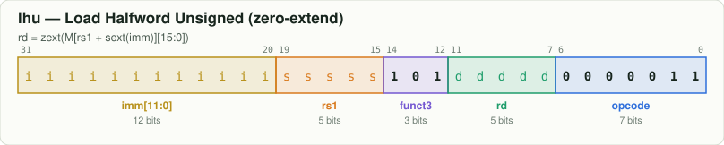
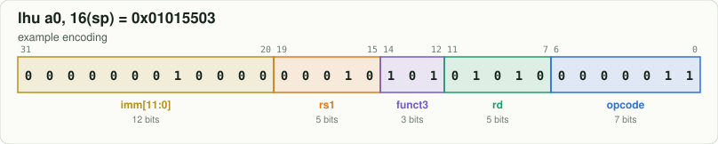

# `lhu`: Load Halfword Unsigned (zero-extend)

[← all instructions](../README.md) · extension **RV64I** · format **I** · category *Load*

```
rd = zext(M[rs1 + sext(imm)][15:0])
```

## Encoding



```
bit:  31                              0
      iiii iiii iiii ssss s101 dddd d000 0011
```

Fixed bits are `0`/`1`. Letters are filled in by the assembler:
`d` = rd, `s` = rs1, `t` = rs2, `i` = immediate, `h` = shift amount, `c` = CSR address, `z` = 5-bit CSR immediate, `f` = funct3, `m/p/u` = fence fields.

## Example

`lhu a0, 16(sp)` assembles to **`0x01015503`** = `00000001000000010101010100000011`



| field | bits | template | example |
|---|---|---|---|
| `imm[11:0]` | 31:20 | `iiiiiiiiiiii` | `000000010000` |
| `rs1` | 19:15 | `sssss` | `00010` |
| `funct3` | 14:12 | `101` | `101` |
| `rd` | 11:7 | `ddddd` | `01010` |
| `opcode` | 6:0 | `0000011` | `0000011` |

Try it yourself:

```bash
node tools/rv.mjs encode "lhu a0, 16(sp)"
node tools/rv.mjs decode 01015503
```

## Control signals from the Control Unit ([`src/Control_Unit.sv`](../../src/Control_Unit.sv))

These are the exact values the RTL produces for the example word above (computed by the
bit-exact twin in `model/core.js`, which `make test` checks against the RTL every cycle).

| signal | value | | signal | value |
|---|---|---|---|---|
| `REGISTER_WRITE_ENABLE` | `1` | | `IS_A_MULTIPLY_DIVIDE_INSTRUCTION` | `0` |
| `MEMORY_READ_ENABLE` | `1` | | `IS_A_BRANCH_INSTRUCTION` | `0` |
| `MEMORY_WRITE_ENABLE` | `0` | | `IS_A_JAL_INSTRUCTION` | `0` |
| `CSR_WRITE_ENABLE` | `0` | | `IS_A_JALR_INSTRUCTION` | `0` |
| `CSR_WRITE_USING_IMMEDIATE` | `0` | | `IMMEDIATE_TYPE_SELECT` | `IMMEDIATE_I` |
| `ALU_INPUT_A_IS_PC` | `0` | | `WRITEBACK_SELECT` | `WRITEBACK_MEMORY` |
| `ALU_INPUT_B_IS_IMMEDIATE` | `1` | | `ALU_OPERATION` | `ALU_ADD` |
| `ALU_IS_WORD_OPERATION` | `0` | |  |  |

## Journey through the 6-stage pipeline

| stage | what happens to `lhu` |
|---|---|
| **FETCH1** | The PC is sent to the instruction memory. At the same time the **GSharePredictor** reads the 2-bit counter at `PC[5:2] XOR GLOBAL_HISTORY_REGISTER` (it does not know yet what instruction this is). |
| **FETCH2** | The 32-bit word arrives from memory. It is not a branch or JAL, so fetching simply continues at `PC + 4`. |
| **DECODE** | **ControlUnit** + **ALUdec** recognise `lhu` from opcode `0000011`, funct3 `101`; the **ImmediateGenerator** builds the I-type immediate. The **RegisterFile** is read for `rs1`, and the forwarding muxes replace a stale value with a newer one from EXECUTE, MEMORY or WRITEBACK. |
| **EXECUTE** | The ALU computes the address `rs1 + imm` and sends it to the data memory. The memory reads the whole aligned doubleword at the end of this cycle. |
| **MEMORY** | The doubleword read in EXECUTE is here. **LoadControl** picks the byte lanes with address bits [2:0] and zero-extends the 16-bit value to 64 bits. This is the earliest point the value can be forwarded, which is why an instruction that needs it right away causes a LOAD_STALL. |
| **WRITEBACK** | The **RegisterFile** writes `rd` at the clock edge (ignored if `rd` is `x0`). The instruction is now **retired** and the `instret` counter goes up by one. |

See the whole datapath in the [block diagram](../../docs/ARCHITECTURE.md) and step through a program in the [web simulator](../../web/index.html).
