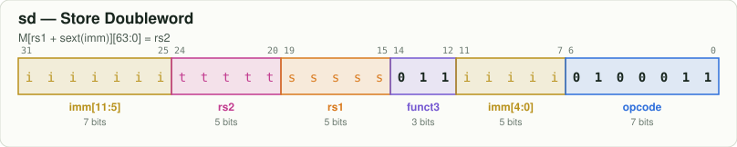
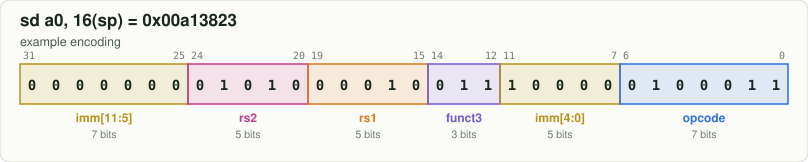

# `sd` — Store Doubleword

[← all instructions](../README.md) · extension **RV64I** · format **S** · category *Store*

```
M[rs1 + sext(imm)][63:0] = rs2
```

## Encoding



```
bit:  31                              0
      iiii iiit tttt ssss s011 iiii i010 0011
```

Fixed bits are `0`/`1`. Letters are filled in by the assembler:
`d` = rd, `s` = rs1, `t` = rs2, `i` = immediate, `h` = shift amount, `f` = funct3, `m/p/u` = fence fields.

## Example

`sd a0, 16(sp)` assembles to **`0x00a13823`** = `00000000101000010011100000100011`



| field | bits | template | example |
|---|---|---|---|
| `imm[11:5]` | 31:25 | `iiiiiii` | `0000000` |
| `rs2` | 24:20 | `ttttt` | `01010` |
| `rs1` | 19:15 | `sssss` | `00010` |
| `funct3` | 14:12 | `011` | `011` |
| `imm[4:0]` | 11:7 | `iiiii` | `10000` |
| `opcode` | 6:0 | `0100011` | `0100011` |

Try it yourself:

```bash
node tools/rv.mjs encode "sd a0, 16(sp)"
node tools/rv.mjs decode 00a13823
```

## Control signals set by the decoder (`rtl/decoder.v`)

| signal | value | | signal | value |
|---|---|---|---|---|
| `use_rs1` | 1 | | `is_load` | 0 |
| `use_rs2` | 1 | | `is_store` | 1 |
| `reg_write` | 0 | | `is_branch` | 0 |
| `alu_op` | ADD | | `is_jal` / `is_jalr` | 0 / 0 |
| `a_sel` | RS1 | | `wb_pc4` | 0 |
| `b_imm` | 1 | | `is_halt` | 0 |
| `is_word` | 0 | | | |

## Journey through the 6-stage pipeline

| stage | what happens to `sd` |
|---|---|
| **IF** | Fetch the 32-bit word at `PC` from instruction memory; predict not-taken: `PC ← PC + 4`. |
| **ID** | Decoder recognises `sd` from opcode `0100011`, funct3 `011`; the immediate generator builds the S-type immediate. |
| **RR** | Read `rs1` and `rs2` from the register file (write-first bypass if WB is writing the same register). |
| **EX** | ALU computes the effective address `rs1 + imm`. Operands may be replaced by forwarded values from EX/MEM or MEM/WB. |
| **MEM** | Write the low 64 bits of `rs2` to memory (address `0x1000_0000` prints a character instead). |
| **WB** | Nothing is written. |
