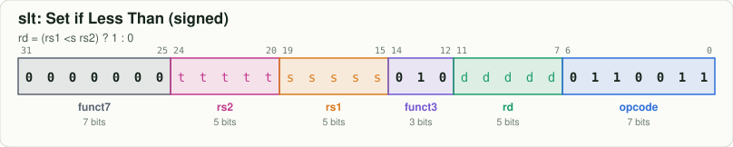
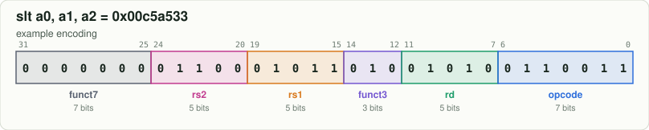

# `slt` — Set if Less Than (signed)

[← all instructions](../README.md) · extension **RV64I** · format **R** · category *Compare*

```
rd = (rs1 <s rs2) ? 1 : 0
```

## Encoding



```
bit:  31                              0
      0000 000t tttt ssss s010 dddd d011 0011
```

Fixed bits are `0`/`1`. Letters are filled in by the assembler:
`d` = rd, `s` = rs1, `t` = rs2, `i` = immediate, `h` = shift amount, `f` = funct3, `m/p/u` = fence fields.

## Example

`slt a0, a1, a2` assembles to **`0x00c5a533`** = `00000000110001011010010100110011`



| field | bits | template | example |
|---|---|---|---|
| `funct7` | 31:25 | `0000000` | `0000000` |
| `rs2` | 24:20 | `ttttt` | `01100` |
| `rs1` | 19:15 | `sssss` | `01011` |
| `funct3` | 14:12 | `010` | `010` |
| `rd` | 11:7 | `ddddd` | `01010` |
| `opcode` | 6:0 | `0110011` | `0110011` |

Try it yourself:

```bash
node tools/rv.mjs encode "slt a0, a1, a2"
node tools/rv.mjs decode 00c5a533
```

## Control signals set by the decoder (`rtl/decoder.v`)

| signal | value | | signal | value |
|---|---|---|---|---|
| `use_rs1` | 1 | | `is_load` | 0 |
| `use_rs2` | 1 | | `is_store` | 0 |
| `reg_write` | 1 (if rd≠x0) | | `is_branch` | 0 |
| `alu_op` | SLT | | `is_jal` / `is_jalr` | 0 / 0 |
| `a_sel` | RS1 | | `wb_pc4` | 0 |
| `b_imm` | 0 | | `is_halt` | 0 |
| `is_word` | 0 | | | |

## Journey through the 6-stage pipeline

| stage | what happens to `slt` |
|---|---|
| **IF** | Fetch the 32-bit word at `PC` from instruction memory; predict not-taken: `PC ← PC + 4`. |
| **ID** | Decoder recognises `slt` from opcode `0110011`, funct3 `010`, funct7 `0000000`; the immediate generator builds the R-type immediate. |
| **RR** | Read `rs1` and `rs2` from the register file (write-first bypass if WB is writing the same register). |
| **EX** | ALU performs **SLT**: `rd = (rs1 <s rs2) ? 1 : 0`. Operands may be replaced by forwarded values from EX/MEM or MEM/WB. |
| **MEM** | No memory access: the result passes through to MEM/WB. |
| **WB** | Write `rd` ← ALU result. |
