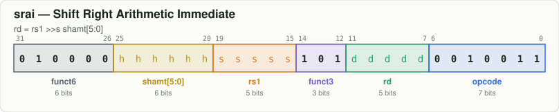
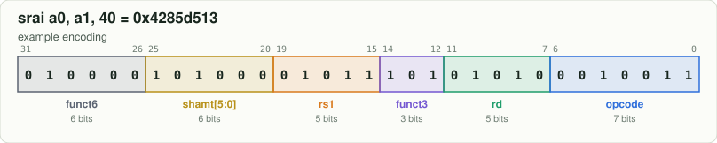

# `srai` — Shift Right Arithmetic Immediate

[← all instructions](../README.md) · extension **RV64I** · format **I-sh64** · category *Shift (imm)*

```
rd = rs1 >>s shamt[5:0]
```

## Encoding



```
bit:  31                              0
      0100 00hh hhhh ssss s101 dddd d001 0011
```

Fixed bits are `0`/`1`. Letters are filled in by the assembler:
`d` = rd, `s` = rs1, `t` = rs2, `i` = immediate, `h` = shift amount, `f` = funct3, `m/p/u` = fence fields.

## Example

`srai a0, a1, 40` assembles to **`0x4285d513`** = `01000010100001011101010100010011`



| field | bits | template | example |
|---|---|---|---|
| `funct6` | 31:26 | `010000` | `010000` |
| `shamt[5:0]` | 25:20 | `hhhhhh` | `101000` |
| `rs1` | 19:15 | `sssss` | `01011` |
| `funct3` | 14:12 | `101` | `101` |
| `rd` | 11:7 | `ddddd` | `01010` |
| `opcode` | 6:0 | `0010011` | `0010011` |

Try it yourself:

```bash
node tools/rv.mjs encode "srai a0, a1, 40"
node tools/rv.mjs decode 4285d513
```

## Control signals set by the decoder (`rtl/decoder.v`)

| signal | value | | signal | value |
|---|---|---|---|---|
| `use_rs1` | 1 | | `is_load` | 0 |
| `use_rs2` | 0 | | `is_store` | 0 |
| `reg_write` | 1 (if rd≠x0) | | `is_branch` | 0 |
| `alu_op` | SRA | | `is_jal` / `is_jalr` | 0 / 0 |
| `a_sel` | RS1 | | `wb_pc4` | 0 |
| `b_imm` | 1 | | `is_halt` | 0 |
| `is_word` | 0 | | | |

## Journey through the 6-stage pipeline

| stage | what happens to `srai` |
|---|---|
| **IF** | Fetch the 32-bit word at `PC` from instruction memory; predict not-taken: `PC ← PC + 4`. |
| **ID** | Decoder recognises `srai` from opcode `0010011`, funct3 `101`, funct6 `010000`; the immediate generator builds the I-sh64-type immediate. |
| **RR** | Read `rs1` from the register file. |
| **EX** | ALU performs **SRA**: `rd = rs1 >>s shamt[5:0]`. Operands may be replaced by forwarded values from EX/MEM or MEM/WB. |
| **MEM** | No memory access: the result passes through to MEM/WB. |
| **WB** | Write `rd` ← ALU result. |
