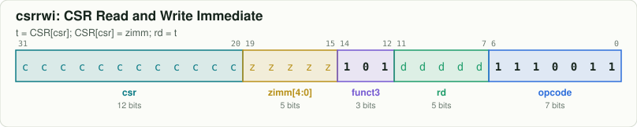
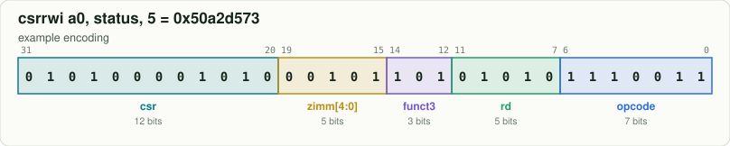

# `csrrwi`: CSR Read and Write Immediate

[← all instructions](../README.md) · extension **Zicsr** · format **CSR-I** · category *CSR*

```
t = CSR[csr]; CSR[csr] = zimm; rd = t
```

## Encoding



```
bit:  31                              0
      cccc cccc cccc zzzz z101 dddd d111 0011
```

Fixed bits are `0`/`1`. Letters are filled in by the assembler:
`d` = rd, `s` = rs1, `t` = rs2, `i` = immediate, `h` = shift amount, `c` = CSR address, `z` = 5-bit CSR immediate, `f` = funct3, `m/p/u` = fence fields.

## Example

`csrrwi a0, status, 5` assembles to **`0x50a2d573`** = `01010000101000101101010101110011`



| field | bits | template | example |
|---|---|---|---|
| `csr` | 31:20 | `cccccccccccc` | `010100001010` |
| `zimm[4:0]` | 19:15 | `zzzzz` | `00101` |
| `funct3` | 14:12 | `101` | `101` |
| `rd` | 11:7 | `ddddd` | `01010` |
| `opcode` | 6:0 | `1110011` | `1110011` |

Try it yourself:

```bash
node tools/rv.mjs encode "csrrwi a0, status, 5"
node tools/rv.mjs decode 50a2d573
```

## Control signals from the Control Unit ([`src/Control_Unit.sv`](../../src/Control_Unit.sv))

These are the exact values the RTL produces for the example word above (computed by the
bit-exact twin in `model/core.js`, which `make test` checks against the RTL every cycle).

| signal | value | | signal | value |
|---|---|---|---|---|
| `REGISTER_WRITE_ENABLE` | `1` | | `IS_A_MULTIPLY_DIVIDE_INSTRUCTION` | `0` |
| `MEMORY_READ_ENABLE` | `0` | | `IS_A_BRANCH_INSTRUCTION` | `0` |
| `MEMORY_WRITE_ENABLE` | `0` | | `IS_A_JAL_INSTRUCTION` | `0` |
| `CSR_WRITE_ENABLE` | `1` | | `IS_A_JALR_INSTRUCTION` | `0` |
| `CSR_WRITE_USING_IMMEDIATE` | `1` | | `IMMEDIATE_TYPE_SELECT` | `IMMEDIATE_Z` |
| `ALU_INPUT_A_IS_PC` | `0` | | `WRITEBACK_SELECT` | `WRITEBACK_CSR` |
| `ALU_INPUT_B_IS_IMMEDIATE` | `0` | | `ALU_OPERATION` | `ALU_COPY_B` |
| `ALU_IS_WORD_OPERATION` | `0` | |  |  |

## Journey through the 6-stage pipeline

| stage | what happens to `csrrwi` |
|---|---|
| **FETCH1** | The PC is sent to the instruction memory. At the same time the **GSharePredictor** reads the 2-bit counter at `PC[5:2] XOR GLOBAL_HISTORY_REGISTER` (it does not know yet what instruction this is). |
| **FETCH2** | The 32-bit word arrives from memory. It is not a branch or JAL, so fetching simply continues at `PC + 4`. |
| **DECODE** | **ControlUnit** + **ALUdec** recognise `csrrwi` from opcode `1110011`, funct3 `101`; the **ImmediateGenerator** builds the Z-type immediate. No registers are needed. |
| **EXECUTE** | The **CSRFile** is read at address `csr` (the old value goes to `rd`) and replaced by the 5-bit zero-extended immediate at the end of the cycle. |
| **MEMORY** | No memory work. **WriteControl** picks the `WRITEBACK_CSR` value, which can be forwarded back to DECODE. |
| **WRITEBACK** | The **RegisterFile** writes `rd` at the clock edge (ignored if `rd` is `x0`). The instruction is now **retired** and the `instret` counter goes up by one. |

See the whole datapath in the [block diagram](../../docs/ARCHITECTURE.md) and step through a program in the [web simulator](../../web/index.html).
