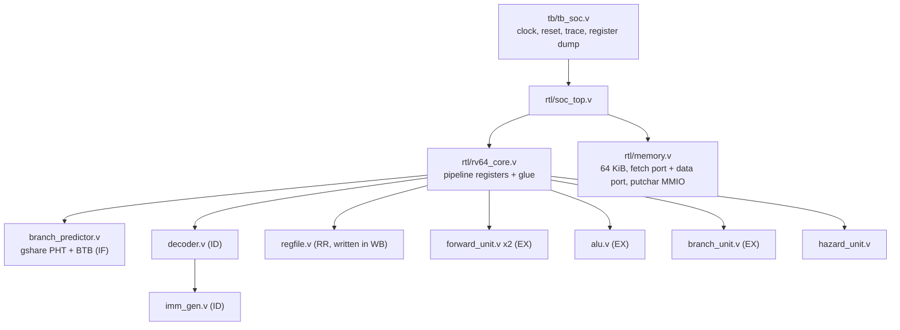

# Architecture: a walk through the RTL


## Module hierarchy



| file | lines of logic | job |
|---|---|---|
| `rtl/rv64_defines.vh` | constants | opcodes, ALU operation codes, sizes, MMIO address |
| `rtl/rv64_core.v` | the pipeline | pipeline registers, stage wiring, the one clocked `always` block |
| `rtl/branch_predictor.v` | IF | gshare pattern history table, global history, branch target buffer |
| `rtl/decoder.v` | ID | instruction bits to control signals |
| `rtl/imm_gen.v` | ID | reassembles the scattered immediate bits |
| `rtl/regfile.v` | RR / WB | 32 x 64-bit, write-first bypass, x0 = 0 |
| `rtl/forward_unit.v` | EX | chooses r / m / w for each operand |
| `rtl/alu.v` | EX | add, sub, shifts, compares, logic, mul, div, rem, and the "W" variants |
| `rtl/branch_unit.v` | EX | taken? and the target address |
| `rtl/hazard_unit.v` | all | stall and flush decisions |
| `rtl/memory.v` | IF + MEM | unified byte-addressed memory |

## The one rule that makes a pipeline work

Everything between two pipeline registers is **combinational**: it computes continuously from its
inputs. On each rising clock edge **all** pipeline registers capture their inputs at the same time.
In `rv64_core.v` this is a single `always @(posedge clk)` block, and every stage's next-state
assignment is visible in one place, in pipeline order (WB side first).

## What each pipeline register carries

| register | fields |
|---|---|
| **IF/ID** | `valid, pc, instr`, prediction `pred_taken, pred_target, pred_idx` |
| **ID/RR** | `valid, pc, imm, rs1, rs2, rd`, control (`use_rs1, use_rs2, reg_write, alu_op, a_sel, b_imm, is_word, is_load, is_store, mem_size, mem_unsigned, is_branch, is_jal, is_jalr, wb_pc4, is_halt, illegal, funct3`), prediction |
| **RR/EX** | everything in ID/RR, plus `rs1_val, rs2_val` read from the register file |
| **EX/MEM** | `valid, pc, rd, reg_write, wb_val` (ALU result or PC+4), `addr, store_data, is_load, is_store, mem_size, mem_unsigned, is_halt, illegal` |
| **MEM/WB** | `valid, pc, rd, reg_write, wb_val` (now including loaded data), `is_halt, illegal` |

`valid = 0` is a **bubble**: the register holds garbage that nothing is allowed to act on.
Flushing an instruction just means clearing its `valid` bit.

## Stage by stage

### IF: fetch and predict
* `imem_addr = pc`; the instruction arrives combinationally from `memory.v`.
* In parallel, `branch_predictor` looks up the Branch Target Buffer (BTB) and the gshare
  counter for this PC.
* Next PC: `pred_taken ? pred_target : pc + 4`. The prediction travels down the pipe so EX can
  check it.
* When the hazard unit says **stall**, `pc` and IF/ID keep their values.

### ID: decode
`decoder.v` looks at `opcode`, `funct3`, `funct7`/`funct6` and produces the control signals in
the table below. `imm_gen.v` rebuilds the immediate. The register numbers are taken from fixed bit
positions, so they are available without decoding. Illegal encodings become `is_halt = 1` with
no register reads, which keeps the hazard logic identical to the model even for garbage fetched
down a wrong path.

| class | use_rs1 | use_rs2 | reg_write | a_sel | b_imm | special |
|---|---|---|---|---|---|---|
| R-type (`add`, `mul`, ...) | 1 | 1 | 1 | RS1 | 0 | `is_word` for OP-32 |
| I-type ALU (`addi`, `slli`, ...) | 1 | 0 | 1 | RS1 | 1 | `is_word` for OP-IMM-32 |
| load | 1 | 0 | 1 | RS1 | 1 | `is_load`, size, signedness |
| store | 1 | 1 | 0 | RS1 | 1 | `is_store`, size |
| branch | 1 | 1 | 0 | - | - | `is_branch`, `funct3` selects the compare |
| `jal` | 0 | 0 | 1 | - | - | `is_jal`, `wb_pc4` |
| `jalr` | 1 | 0 | 1 | RS1 | 1 | `is_jalr`, `wb_pc4` |
| `lui` / `auipc` | 0 | 0 | 1 | ZERO / PC | 1 | |
| `ecall` / `ebreak` | 0 | 0 | 0 | - | - | `is_halt` |
| `fence` | 0 | 0 | 0 | - | - | no-op |

Per-instruction tables for all 65 instructions are in [`binary/`](../binary/README.md).

### RR: register read
`regfile.v` has two read ports addressed by `id_rr_rs1` / `id_rr_rs2`. If WB writes the same
register in the same cycle, the read returns the **new** value (write-first bypass).

### EX: execute and resolve
1. **Forwarding**: `forward_unit` decides, per operand, whether to use the value read in RR, the
   EX/MEM value (1 instruction ahead) or the MEM/WB value (2 ahead).
2. **Operand select**: A is rs1, PC or 0; B is rs2 or the immediate.
3. **ALU** computes the result or memory address.
4. **Branch unit** computes taken and target; the core compares this with the prediction:
   `mispredict = (taken != pred_taken) or (taken and target != pred_target)`.
   On a misprediction: `pc <- taken ? target : pc + 4`, and IF/ID, ID/RR, RR/EX are cleared.
5. **Predictor update** on the same clock edge: counter, global history, BTB entry.

### MEM: memory
Loads read 8 bytes at the address and then keep 1/2/4/8 of them, sign- or zero-extended. Stores
write on the clock edge. A store to `0x1000_0000` prints a character in the simulator instead.

### WB: write back
`regfile[rd] <- wb_val` if `reg_write`. When an `ecall`/`ebreak` reaches WB the core sets
`halted` and freezes; the testbench dumps the registers.

## Hazard rules (exact)

```
 load_use = RR/EX.valid && RR/EX.is_load && RR/EX.rd != 0 && ID/RR.valid &&
            ((ID/RR.use_rs1 && ID/RR.rs1 == RR/EX.rd) || (ID/RR.use_rs2 && ID/RR.rs2 == RR/EX.rd))
 flush    = (RR/EX.valid && mispredict) || (RR/EX.valid && RR/EX.is_halt)
 stall    = load_use && !flush
```

| event | PC | IF/ID | ID/RR | RR/EX | EX/MEM | MEM/WB |
|---|---|---|---|---|---|---|
| normal | next PC | advance | advance | advance | advance | advance |
| stall (load-use) | hold | hold | hold | **bubble** | advance | advance |
| flush (mispredict) | **correct PC** | **bubble** | **bubble** | **bubble** | advance | advance |
| flush (halt in EX) | hold, stop fetching | **bubble** | **bubble** | **bubble** | advance | advance |

## How the model and the RTL stay identical

`sim/core.js` computes each cycle in the same order as the hardware: WB, MEM, EX, RR, ID, IF all
read the *current* register contents; then every update (register file, memory, predictor
tables, pipeline registers) is applied together, like a clock edge. The testbench and the model
print the same trace line per cycle:

```
C12 IF:0000001c ID:00000018 RR:00000014 EX:00000010 MEM:0000000c WB:00000008 FLUSH
```

`make test` diffs these line by line for every program with the predictor on and off.
