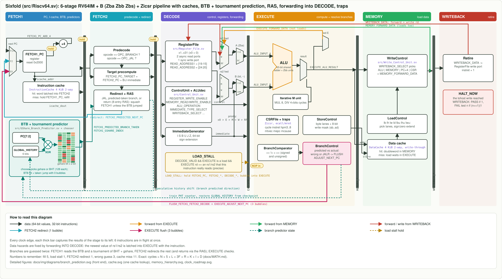

# Architecture reference

The complete description of `Riscv64` ([`src/Riscv64.sv`](../src/Riscv64.sv)). For a gentler
introduction read the [learning path](learn/README.md) first.

## Summary

| property | value |
|---|---|
| instruction set | RV64I + M (multiply/divide) + Zicsr (CSR instructions): 71 instructions, see [`binary/`](../binary/README.md) |
| pipeline | 6 stages, in order, single issue: FETCH1, FETCH2, DECODE, EXECUTE, MEMORY, WRITEBACK |
| data hazards | forwarding **into DECODE** from EXECUTE, MEMORY, WRITEBACK; 1-cycle `LOAD_STALL` |
| branch prediction | `GSharePredictor`: 2^`GSHARE_HISTORY_BITS` two-bit counters (default 4 bits = 16), speculative global history with checkpoint repair |
| branch penalties | predicted-taken branch or JAL: 1 bubble (FETCH2 redirect); wrong guess or any JALR: 3 bubbles (flush) |
| memory | `ScratchpadMemory`: 64 KiB unified, instruction port (32-bit) and data port (64-bit, byte mask), no stalls |
| reset PC | `0x2000` (`PC_RESET` in [`src/const_pkg.sv`](../src/const_pkg.sv)) |
| program end | write a nonzero value to the `tohost` CSR; the core halts when that instruction reaches WRITEBACK |
| verification | every program, every cycle, RTL vs [`model/core.js`](../model/core.js), predictor on and off (`make test`) |

## Source files

| file | module | stage | role |
|---|---|---|---|
| [`Opcode_pkg.sv`](../src/Opcode_pkg.sv) | `opcode_pkg` | | opcodes and funct3/funct7 codes (RV64I, M, Zicsr) |
| [`ALUop_pkg.sv`](../src/ALUop_pkg.sv) | `alu_op_pkg` | | `alu_op_t` enum (ALU and M operations) |
| [`IMMEDIATEop_pkg.sv`](../src/IMMEDIATEop_pkg.sv) | `immediate_op_pkg` | | immediate formats I S B U J Z |
| [`WRITEBACK_op_pkg.sv`](../src/WRITEBACK_op_pkg.sv) | `writeback_op_pkg` | | writeback sources ALU, MEMORY, PC_ADD_4, CSR |
| [`const_pkg.sv`](../src/const_pkg.sv) | `const_pkg` | | reset PC, memory size, MMIO and CSR addresses |
| [`GShare_Branch_Predictor.sv`](../src/GShare_Branch_Predictor.sv) | `GSharePredictor` | FETCH1 (read), FETCH2 (history), EXECUTE (train/repair) | branch direction prediction |
| [`Control_Unit.sv`](../src/Control_Unit.sv) | `ControlUnit` | DECODE | all control signals from the instruction bits |
| [`ALUdec.sv`](../src/ALUdec.sv) | `ALUdec` | DECODE | opcode + funct3 + funct7 bits to `alu_op_t` |
| [`Immediate_Generator.sv`](../src/Immediate_Generator.sv) | `ImmediateGenerator` | DECODE | builds and sign-extends immediates to 64 bits |
| [`Register_File.sv`](../src/Register_File.sv) | `RegisterFile` | DECODE (read), WRITEBACK (write) | x1..x31, 2 asynchronous reads, 1 synchronous write |
| [`ALU.sv`](../src/ALU.sv) | `ALU` | EXECUTE | shared 65-bit adder, logic, shifts, 32-bit W variants |
| [`Multiply_Divide_Unit.sv`](../src/Multiply_Divide_Unit.sv) | `MultiplyDivideUnit` | EXECUTE | M extension (single cycle, combinational) |
| [`Branch_Comparator.sv`](../src/Branch_Comparator.sv) | `BranchComparator` | EXECUTE | beq bne blt bge bltu bgeu |
| [`Branch_Control_Unit.sv`](../src/Branch_Control_Unit.sv) | `BranchControl` | EXECUTE | prediction check, `FLUSH`, `ADJUST_NEXT_PC` |
| [`Control_Status_Register_File.sv`](../src/Control_Status_Register_File.sv) | `CSRFile` | EXECUTE | tohost, status, cycle, instret, hartid |
| [`Store_Control_Unit.sv`](../src/Store_Control_Unit.sv) | `StoreControl` | EXECUTE | byte lanes and write mask for sb sh sw sd |
| [`Load_Control_Unit.sv`](../src/Load_Control_Unit.sv) | `LoadControl` | MEMORY | lane select and extension for all 7 loads |
| [`Write_Control_Unit.sv`](../src/Write_Control_Unit.sv) | `WriteControl` | MEMORY | writeback multiplexer (also the MEMORY forward value) |
| [`Scratchpad_Memory.sv`](../src/Scratchpad_Memory.sv) | `ScratchpadMemory` | FETCH1/EXECUTE | 64 KiB memory and the putchar port |
| [`Riscv64.sv`](../src/Riscv64.sv) | `Riscv64` | all | the pipeline: registers, hazards, forwarding |
| [`Riscv64_top.sv`](../src/Riscv64_top.sv) | `riscv64_top` | | core + memory |

## Coding style

The RTL follows the style of the original EECS 151 design so it reads like one project:
`` `default_nettype none`` in every file, packages for every encoding, `always_comb` / `always_ff`
/ `unique case`, and long UPPER_CASE signal names that begin with the stage that owns them
(`DECODE_FORWARDED_REGISTER1_DATA`, `EXECUTE_ADJUST_NEXT_PC`), each with a comment saying what it
is. A signal named `STAGE_X` is combinational inside that stage or is that stage's pipeline register.

## Stage by stage

### FETCH1
`FETCH1_PC` addresses the instruction memory. In the same cycle the `GSharePredictor` computes
`FETCH1_GSHARE_INDEX = FETCH1_PC[5:2] ^ GLOBAL_HISTORY_REGISTER` and reads that counter's upper bit
as `FETCH1_PREDICTED_BRANCH_TAKEN`. The next PC is chosen by priority: the EXECUTE flush target,
then the FETCH2 redirect target, then `FETCH1_PC + 4`.

### FETCH2
`FETCH2_INSTRUCTION` holds the word (the pipeline register acts as the output register of a
synchronous SRAM). Predecode looks only at the opcode: `OPC_BRANCH` or `OPC_JAL`. The branch and
jump immediates are unscrambled here and `FETCH2_PC_TARGET = FETCH2_PC + imm` is precomputed.
`FETCH2_BRANCH_OFF_OR_CONTINUE` (a JAL, or a branch predicted taken) sends FETCH1 to the target and
marks the instruction currently in FETCH1 invalid. When a branch leaves FETCH2 its predicted
direction is shifted into the global history, and the history value before the shift travels down
the pipeline as `DECODE_GLOBAL_HISTORY_CHECKPOINT`.

### DECODE
`ControlUnit` (with `ALUdec`) and `ImmediateGenerator` decode the instruction; the `RegisterFile` is
read at `[19:15]` and `[24:20]`. Each operand then passes the forwarding chain
x0 > EXECUTE (non-load) > MEMORY > WRITEBACK > register file. The chosen values are what EXECUTE
receives, so EXECUTE has no forwarding muxes on its inputs.

`LOAD_STALL = DECODE_VALID && EXECUTE_VALID && EXECUTE_MEMORY_READ_ENABLE && rd != 0 && (rd == rs1 field || rd == rs2 field)`.

### EXECUTE
Operand muxes (`ALU_INPUT_A_IS_PC`, `ALU_INPUT_B_IS_IMMEDIATE`) feed the `ALU`; M instructions use
the `MultiplyDivideUnit`. `BranchComparator` evaluates the condition and `BranchControl` decides:

| instruction | `FLUSH` | `ADJUST_NEXT_PC` | predictor |
|---|---|---|---|
| branch, guess right | 0 | (unused) | train counter |
| branch, guess wrong | 1 | taken ? target : PC + 4 | train counter, restore history = checkpoint shifted with the real outcome |
| JAL | 0 (already redirected in FETCH2) | target | nothing |
| JALR | 1 | `(rs1 + imm) & ~1` | restore history = checkpoint |

`FLUSH_FETCH1_FETCH2_DECODE` squashes the three younger instructions and puts a bubble into
EXECUTE. The `CSRFile` is read (old value to rd) and written (RW/RS/RC semantics) here. Stores write
memory at the end of this cycle; loads read the aligned doubleword at the end of this cycle.

### MEMORY
`MEMORY_DATA_CACHE_DATA` holds the doubleword; `LoadControl` selects lanes with address bits [2:0]
and extends. `WriteControl` selects the result by `WRITEBACK_SELECT`; that value is
`MEMORY_FORWARD_DATA` (forwarded to DECODE) and becomes `WRITEBACK_DATA` at the edge.

### WRITEBACK
The register file is written at the clock edge and the `instret` counter increments. If this
instruction wrote a nonzero `tohost`, `HALT_NOW` freezes everything else and the testbench prints the
result: `tohost = 1` is PASS, `(n << 1) | 1` is FAIL in test n (the riscv-tests convention).

## Memory map and CSRs

| address / CSR | meaning |
|---|---|
| `0x0000_2000` | reset PC: first instruction |
| `0x0000_0000` to `0x0000_FFFF` | 64 KiB RAM (addresses wrap) |
| `0x1000_0000` | store a byte here to print a character |
| CSR `0x51E` `tohost` | program result (read/write) |
| CSR `0x50A` `status` | scratch register (read/write) |
| CSR `0x50B` `hartid`, `0xF14` `mhartid` | always 0 |
| CSR `0xC00` `cycle` | clock cycles since reset (read-only) |
| CSR `0xC02` `instret` | instructions retired since reset (read-only) |

## Timing rules (exact)

| event | bubbles |
|---|---:|
| pipeline fill at reset | 5 |
| `LOAD_STALL` | 1 |
| FETCH2 redirect (predicted-taken branch, JAL) | 1 (0 if a flush squashes the redirecting instruction) |
| flush (wrong branch guess, JALR) | 3 |

`cycles = N + 5 + L + 3F + R` holds exactly; see [MATH.md](MATH.md).
