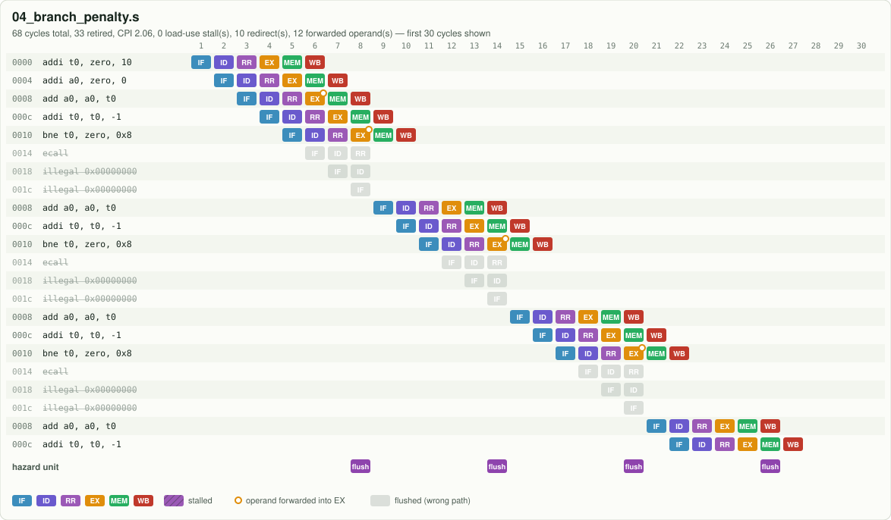
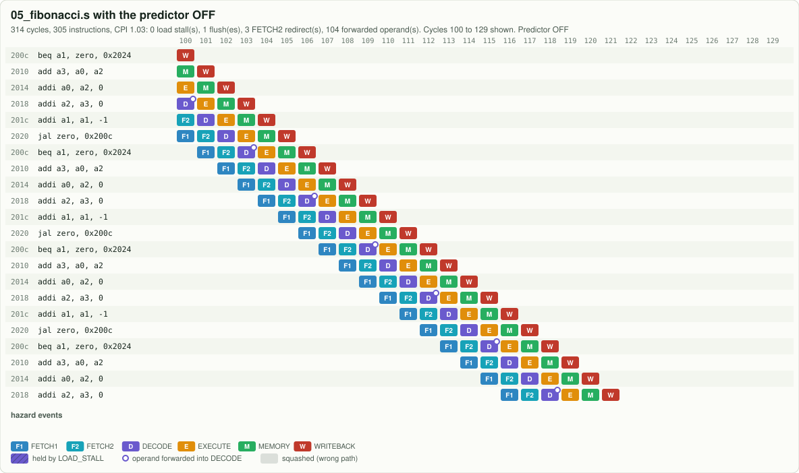
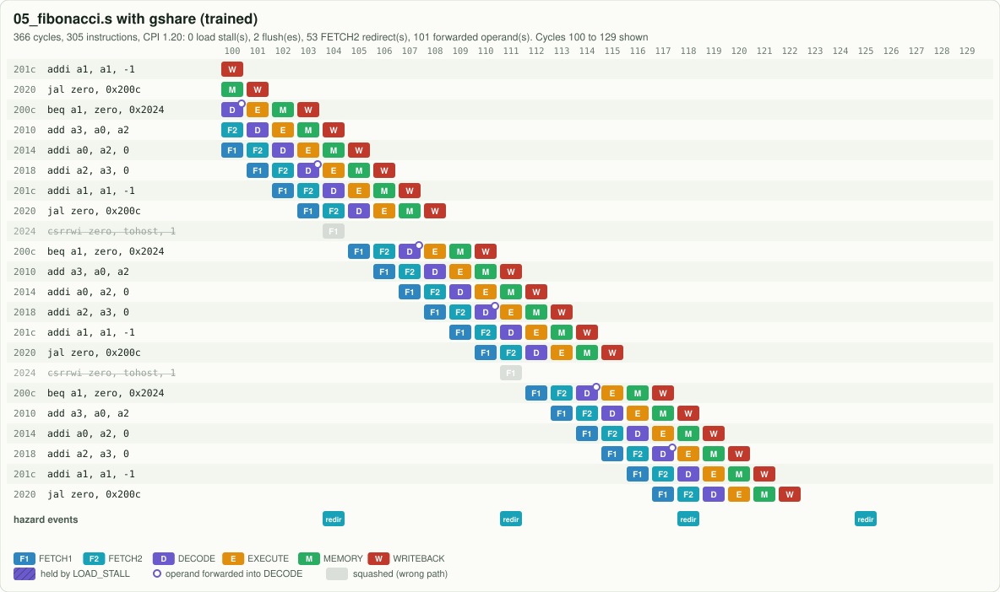
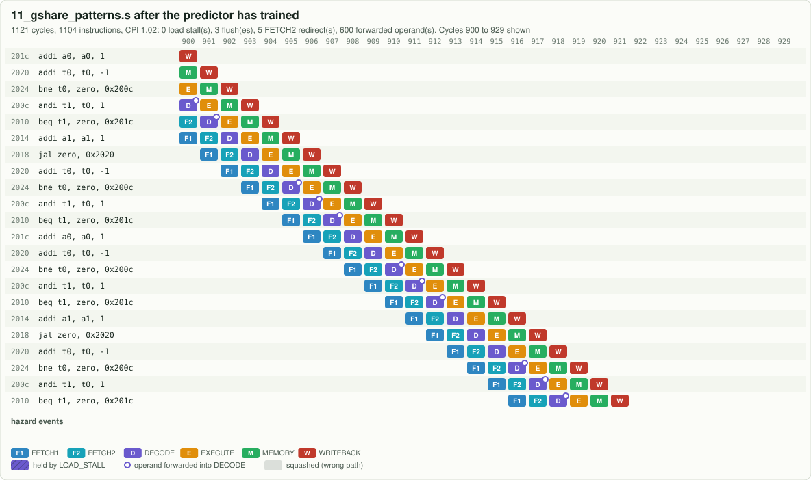
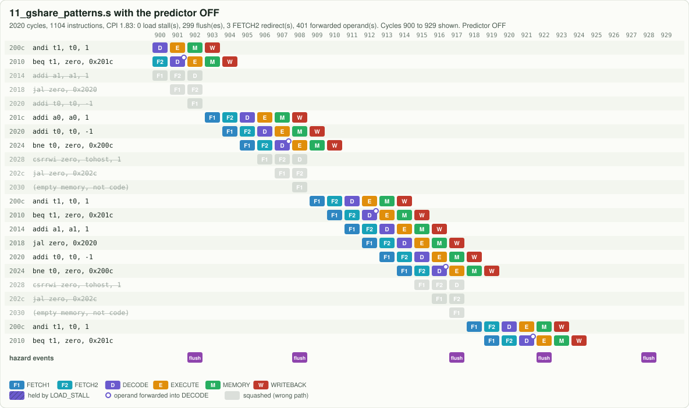

# Experiments

Each program in [`programs/`](../programs) isolates one idea. For every one you can:

```bash
make run   PROG=<name>          # result, registers, statistics  (add BP=0 to disable gshare)
make pipe  PROG=<name>          # coloured pipeline chart in the terminal
make cycle PROG=<name> C=<n>    # everything that happens in clock cycle n
make bp    PROG=<name>          # none vs bimodal vs gshare
make rtl   PROG=<name>          # the same program on the Verilog
make wave  PROG=<name>          # waveforms in GTKWave
```

or pick it in the browser simulator (`make serve`, then http://localhost:8000/web/).

---

## 00 · Pipeline fill: latency versus throughput


Four independent instructions. The first result needs 6 cycles (latency); after that one
instruction finishes every cycle (throughput). **Question:** with N independent instructions, how
many cycles? (Answer: N + 5. See [MATH.md §3](MATH.md).)

## 01 · Hello, world through memory-mapped I/O
`sb` to `0x1000_0000` prints a character. Each loop iteration has a load-use stall (`lbu` then
`beqz` on the loaded byte). **Try:** `make run PROG=01_hello BP=0` versus the default: 166 versus
124 cycles, because gshare learns the loop branch.

## 02 · Forwarding: a dependent chain with zero stalls


Every instruction needs the one before it. Rings mark forwarded operands. **Try:**
`make cycle PROG=02_forwarding C=6` shows both operands of `add a0, a0, a0` coming from EX/MEM.

## 03 · The load-use hazard, and how a compiler hides it


Part A uses each loaded value immediately (2 stalls, hatched cells). Part B does the same loads
with independent work in between (0 stalls). Same result, fewer cycles.

## 04 · Branch penalty, and gshare's warm-up cost


A 10-iteration loop. Without prediction, 9 taken branches x 3 cycles. With gshare it is slightly
*worse* (10 mispredictions) because each new history value hits an untrained counter.
[MATH.md §5c](MATH.md) works out every one of those 10 by hand. `make bp PROG=04_branch_penalty`
shows bimodal gets it down to 2.

## 05 · Fibonacci in 64 bits: what prediction buys
| predictor off | gshare, trained |
|---|---|
|  |  |

fib(50) = 12,586,269,025 needs more than 32 bits. CPI drops from 1.52 to 1.04.

## 06 · Bubble sort: a realistic mix
Loads, stores, compares, data-dependent branches: 72 load-use stalls, and the data-dependent
`ble` is the hardest branch to predict. CPI 1.69 without prediction, 1.30 with gshare.

## 07 · Recursion: `call`, `ret` and the stack
`fact(20)` = 2,432,902,008,176,640,000 via 20 nested calls. `ret` is `jalr`: its target
depends on who called. Here 19 returns go back inside `fact` and the last one returns to the
top-level caller, so the BTB's remembered target is wrong exactly there. Real cores add a return
address stack (CVA6 has one **[12]**) because this pattern is everywhere.

## 08 · GCD with `rem`
The M extension's remainder instruction, used by Euclid's algorithm.

## 09 · Sieve of Eratosthenes: the big benchmark
14,841 instructions. Without prediction 25,771 cycles; with gshare 17,134 (1.50x faster).
`make math` shows the equation `N + 5 + L + 3M` predicting both numbers exactly.

## 10 · Printing numbers with `divu` and `remu`
Binary to decimal by repeated division by 10. Output:
`0 1 1 2 3 5 8 13 21 34 55 89 144 233 377 610`.

## 11 · Correlated branches: where gshare shines
| gshare, trained: no flushes | predictor off: a flush every iteration |
|---|---|
|  |  |

A branch alternating taken / not taken. Bimodal: 59.4% accuracy. gshare: 97.4%. In the browser,
watch the predictor heat map: two counters for the same branch turn orange and blue, one per
history pattern.

---

# Hardware labs

These change the RTL. After each change run `make test`: the regression compares the RTL with
the model, so either change both identically, or treat the failing diff as your debugger.

### Lab 1: resize the predictor
Change `GHR_BITS` in `rtl/rv64_core.v` (the `branch_predictor` instance) **and** in
`sim/core.js`. Plot mispredictions of `09_primes_sieve` against table size. When does a bigger
table stop helping, and why does a *smaller* history sometimes win? (Aliasing versus warm-up.)

### Lab 2: build McFarling's combined predictor
Add a bimodal table and a table of 2-bit "chooser" counters, as in section 8 of McFarling's paper
**[7]**. Target: at least bimodal's accuracy on `04` and gshare's on `11`.

### Lab 3: speculative global history
Update the GHR at prediction time in IF, and restore it from a copy carried down the pipe on a
misprediction **[10]**. Measure the accuracy change on `06_bubble_sort`.

### Lab 4: a multi-cycle divider
Replace the combinational divider with a 1-bit-per-cycle restoring divider (64 cycles) and stall
the pipe while it runs. `make synth`: the ALU should shrink dramatically. Then think about T_clk
using [MATH.md §2](MATH.md): which is faster overall?

### Lab 5: remove forwarding
Force both forward selects to `r` and add stalls in the hazard unit until every test passes
again. Compare CPI with `make math`. This is why every real pipeline forwards.

### Lab 6: resolve jumps earlier
`jal` targets are known in ID. Redirect from ID for `jal` (1-cycle penalty instead of 3) and
update the equation in MATH.md: it gains a new term.

### Lab 7: write your own program
In the browser simulator, open **Edit source**, write assembly, and press **Assemble and load**.
Supported syntax: all RV64IM instructions, labels, `.byte .half .word .dword .string .zero .align`,
and pseudo-instructions `li la mv not neg j call ret beqz bnez bgt ble` and more (see the top of
`sim/asm.js`). Halt with `ecall`.

---

# Waveforms with GTKWave

```bash
make wave PROG=03_load_use
```

This writes `build/03_load_use.vcd` and opens it with [`docs/gtkwave/pipeline.gtkw`](gtkwave/pipeline.gtkw),
a pre-arranged view grouped by stage: PC and prediction, every pipeline register's `valid` and
`pc`, the forward selects, ALU inputs and output, `mispredict`, `stall`, `flush`. Look for the
cycle where `stall` goes high: `pc` and `if_id_pc` hold their value while `rr_ex_valid` drops to 0.

On Windows Subsystem for Linux 2 (WSL2), GTKWave opens through WSLg on Windows 11. If no window
appears, copy the `.vcd` to Windows and open it with the Windows build of GTKWave, or use the
browser simulator.
