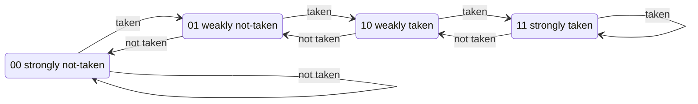
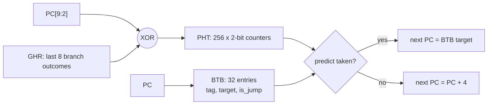

# The math behind the pipeline, and proof that it works

Every equation on this page is checked against the design. `make math` recomputes the
performance equation for every program and compares it with the cycle-accurate model, and
`make test` proves the model and the Verilog Register Transfer Level (RTL) agree on every
single clock cycle. Numbers in brackets like **[3]** point to [REFERENCES.md](REFERENCES.md).

---

## 1. The Iron Law of processor performance

The time a program takes is the product of three independent factors **[2, ch. 1] [3, ch. 1]**:

```
            instructions      cycles        seconds
  Time  =  ------------  x  -----------  x  -------
             program        instruction      cycle

        =        N        x     CPI      x   T_clk
```

* **N** is fixed by the Instruction Set Architecture (ISA) and the compiler. This repo does not change it.
* **CPI** (Cycles Per Instruction) is what the *microarchitecture* controls: pipelining, forwarding,
  stalls, branch prediction. Most of this document is about CPI.
* **T_clk** (the clock period) is set by the slowest pipeline stage. Section 2.

Pipelining attacks T_clk; hazards push CPI back up; prediction and forwarding pull it down again.

---

## 2. Why pipelining makes the clock faster

A single-cycle processor must fit fetch + decode + read + execute + memory + write-back into one
clock period. A pipeline puts a register (a row of flip-flops) between the steps, so each clock
period only has to cover **one** step **[2, ch. 4] [4, ch. 7]**:

```
 T_clk  >=  t_clk->q  +  max( t_IF, t_ID, t_RR, t_EX, t_MEM, t_WB )  +  t_setup  (+ clock skew)
```

* `t_clk->q`: delay from the clock edge until a flip-flop's output changes
* `t_setup`: how long the next flip-flop's input must be stable before the edge
* the `max(...)`: the slowest stage sets the pace for all of them

With S perfectly balanced stages and no register overhead, the clock gets S times faster, so the
ideal speed-up is **S = 6**. Two things stop that from being reached:

1. **Register overhead** (`t_clk->q + t_setup`) is paid once per stage, so very deep pipelines stop helping.
2. **Hazards** add bubbles, raising CPI above 1 (Section 3).

### Measured logic depth in this design

Yosys maps each module to generic gates and reports the longest chain of gates (logic levels)
that a signal must ripple through between registers:

| module | logic levels | what it means |
|---|---|---|
| `forward_unit` | 8 | two 5-bit comparisons and a priority mux: trivially fast |
| `hazard_unit` | 8 | same kind of logic |
| `decoder` | 13 | opcode/funct decoding |
| `branch_unit` | 127 | 64-bit compare + 64-bit adders with a generic ripple mapping |
| `alu` | far larger | a combinational 64-bit **divider** is by far the deepest path |

So the EX stage sets this core's clock, and the divider is the reason. Real cores such as CVA6
(Ariane) compute division over many cycles in a separate unit **[11] [12]** so EX stays short.
Changing that is a suggested exercise in [EXPERIMENTS.md](EXPERIMENTS.md). Commands:
`make synth`, and for one module:
`yosys -p "read_verilog -Irtl rtl/decoder.v rtl/imm_gen.v; synth -top decoder -flatten; ltp -noff"`.

**Why 6 stages and not 5?** The textbook 5-stage pipeline **[2, ch. 4]** decodes *and* reads the
register file in one stage. Here that work is split into ID (decode) and RR (register read), the
same idea CVA6 uses to shorten its critical path **[11]**. The cost appears in Section 4: a branch
now resolves one stage later, so a misprediction wastes 3 cycles instead of 2.

---

## 3. The exact cycle equation

For this pipeline, for every program, the total number of cycles is exactly:

```
 cycles  =  N  +  (S - 1)  +  L  +  P x M

 N = instructions retired (including the final ecall)
 S = 6 stages               ->  S - 1 = 5 cycles to fill the pipe
 L = load-use stall cycles  (1 bubble each)
 P = misprediction penalty  = 3 cycles
 M = number of mispredictions (redirects from EX)
```

Dividing by N gives CPI:

```
 CPI  =  1  +  (S-1)/N  +  L/N  +  P x M/N
         ^      ^          ^       ^
       ideal  fill/drain  data    control hazards
```

### Derivation

Watch the **WB** stage. Every cycle, WB either retires exactly one instruction or holds a
bubble. So

```
 cycles = (cycles in which WB retires something) + (cycles in which WB is empty)
        =                  N                     + (empty WB cycles)
```

Empty WB cycles come from exactly three sources:

1. **Fill.** The first instruction needs S = 6 cycles to reach WB, so cycles 1 to 5 have an
   empty WB: **5 cycles**.
2. **Load-use stalls.** Each stall inserts one bubble into EX. The bubble reaches WB two cycles
   later: **1 cycle per stall**.
3. **Mispredictions.** A redirect from EX squashes the instructions in IF, ID and RR. Those three
   slots arrive at WB empty: **3 cycles per misprediction**.

Nothing else creates a bubble. Flushing on `ecall` also squashes three slots, but the program ends
when the `ecall` retires, before those slots would have reached WB, so it costs nothing. That
gives the equation. It is a theorem about this design, not an approximation.

### Verification (from `make math`)

| program | predictor | N | L | M | N + 5 + L + 3M | measured cycles | CPI |
|---|---|---:|---:|---:|---:|---:|---:|
| 00_pipeline_fill | on | 5 | 0 | 0 | 10 | 10 | 2.000 |
| 03_load_use | on | 11 | 2 | 0 | 18 | 18 | 1.636 |
| 04_branch_penalty | off | 33 | 0 | 9 | 65 | 65 | 1.970 |
| 04_branch_penalty | on | 33 | 0 | 10 | 68 | 68 | 2.061 |
| 05_fibonacci | off | 305 | 0 | 51 | 463 | 463 | 1.518 |
| 05_fibonacci | on | 305 | 0 | 2 | 316 | 316 | 1.036 |
| 06_bubble_sort | off | 721 | 72 | 139 | 1215 | 1215 | 1.685 |
| 06_bubble_sort | on | 721 | 72 | 47 | 939 | 939 | 1.302 |
| 09_primes_sieve | off | 14841 | 1028 | 3299 | 25771 | 25771 | 1.736 |
| 09_primes_sieve | on | 14841 | 1028 | 420 | 17134 | 17134 | 1.155 |
| 11_gshare_patterns | off | 1104 | 0 | 399 | 2306 | 2306 | 2.089 |
| 11_gshare_patterns | on | 1104 | 0 | 13 | 1148 | 1148 | 1.040 |

All 26 program/predictor combinations match exactly. Because `make test` shows the Verilog is
cycle-for-cycle identical to the model, the equation holds for the hardware too.

**What the numbers say.** `00_pipeline_fill` has CPI 2.0 only because 5 fill cycles are spread
over just 5 instructions. As N grows, `(S-1)/N` vanishes: for the sieve it is 0.0003. The
remaining CPI is almost entirely hazards, which is why forwarding and prediction matter.

---

## 4. Hazards, one at a time

### 4a. Data hazards and forwarding

`add a0, a0, a1` directly after `addi a0, a0, 2` needs a result that is still in the pipe. Without
forwarding the consumer would wait until the producer writes back: up to 3 stall cycles in this
pipeline. The forward unit instead copies the value straight out of a pipeline register
**[2, ch. 4]**:

| producer is ... when consumer is in EX | value lives in | forward select |
|---|---|---|
| 1 instruction ahead (now in MEM) | EX/MEM register | `m` |
| 2 instructions ahead (now in WB) | MEM/WB register | `w` |
| 3 instructions ahead (was in WB while consumer in RR) | register file (write-first bypass) | `r` |

Priority goes to the **nearest** producer, since it is the most recent write to that register.
`02_forwarding` is a chain of 6 dependent instructions and has **L = 0, M = 0**.

### 4b. The load-use hazard: why one stall is unavoidable

A load's data exists only at the **end** of MEM. A dependent instruction right behind it
needs the value at the **start** of EX in the same cycle. That would require sending data
backwards in time, so the hazard unit holds IF, ID and RR for one cycle and injects a bubble
**[2, ch. 4]**. The rule, exactly as in `rtl/hazard_unit.v`:

```
 stall  =  (EX holds a load)  AND  (its rd != x0)
           AND  (RR instruction reads rs1 == rd  OR  reads rs2 == rd)
```

`03_load_use` shows 2 stalls in the naive order and 0 after reordering the same work: a compiler
optimisation called instruction scheduling.

### 4c. Control hazards and the misprediction penalty

The next PC is chosen in **IF** (stage 1). A branch's real outcome is known in **EX** (stage 4).
Every instruction fetched in between is a guess:

```
 P  =  stage where branches resolve  -  stage where PC is chosen
    =          4 (EX)                -          1 (IF)          =  3 cycles
```

In the 5-stage textbook pipeline, EX is stage 3, so P = 2 **[2, ch. 4]**. The extra RR stage buys a
shorter clock period and costs one extra cycle per misprediction. That is the classic
depth-versus-penalty trade-off **[3, ch. 3]**.

Without a predictor ("predict not-taken"), **every** taken branch and **every** jump is a
misprediction. Loops are mostly taken branches, so this is expensive: without prediction the sieve
spends 10,930 cycles beyond N, and 9,897 of them (3 x 3,299) are misprediction bubbles.

---

## 5. Branch prediction

### 5a. The 2-bit saturating counter (Smith, 1981) [5]



Predict taken when the counter is 10 or 11 (its top bit). Two wrong guesses in a row are needed
to flip a strong prediction, so a loop-closing branch that is taken n-1 times and then falls
through once costs **one** misprediction per loop execution, not two. For a loop that runs n
times the steady-state accuracy of that branch is **(n-1)/n**.

### 5b. gshare (McFarling, 1993) [7]

A table of these counters is indexed by the branch address. gshare mixes in the **global history
register** (GHR): the outcomes of the most recent branches, as a shift register.

```
 index  =  PC[9:2]  XOR  GHR[7:0]            (256 counters, 8 history bits)
 predict taken  <=>  BTB hit  AND  (entry is a jump  OR  PHT[index] >= 2)
```



The Branch Target Buffer (BTB) is needed because in IF the instruction has not been decoded yet,
so the core cannot know *where* a branch goes until it has seen it taken once **[3, ch. 3]**.

Why XOR instead of just the PC? The same branch now uses a **different counter in each history
context**. A branch whose direction depends on what earlier branches did (if/else chains,
alternating patterns) becomes a set of branches that each always go one way, which a 2-bit counter
learns perfectly. McFarling chose XOR over concatenation (gselect) because it uses the table more
evenly for the same size **[7]**.

### 5c. Worked example: why gshare *loses* on a short loop

`04_branch_penalty` is a 10-iteration loop. Measured: no predictor M = 9, bimodal M = 2,
gshare M = 10. The counts follow exactly from the rules above.

**Bimodal** (one counter per branch, no history), counter starts at 01:

| iteration | BTB | counter before | prediction | actual | mispredict? | counter after |
|---|---|---|---|---|---|---|
| 1 | miss | 01 | not taken | taken | **yes** | 10 |
| 2-9 | hit | 10 then 11 | taken | taken | no | 11 |
| 10 | hit | 11 | taken | not taken | **yes** | 10 |

M = 2. ✓

**gshare**: every taken branch shifts a 1 into the GHR, so for the first 8 iterations the GHR is
different each time (00000000, 00000001, 00000011, ...) and every lookup lands on a **fresh,
untrained** counter at 01, which predicts not-taken. Iterations 9 and 10 both see GHR = 11111111
and share one counter: iteration 9 trains it from 01 to 10, so iteration 10 predicts taken and is
wrong. **All 10 are mispredicted.** M = 10. ✓

This is the **warm-up / training cost** of global history: gshare spreads one branch over many
counters, and each has to learn separately. It is exactly why McFarling's paper proposed
*combining* a bimodal and a gshare predictor with a chooser **[7]**, and why the Alpha 21264 shipped
a tournament predictor **[3, ch. 3]**.

### 5d. Where gshare wins: correlated branches

`11_gshare_patterns` has a branch that alternates taken, not-taken, taken, ... A single counter
sees T, N, T, N and just oscillates. With history, "last outcome was T" and "last outcome was N"
index different counters, and each one always sees the same direction.

From `node tools/rv.mjs bp programs/<name>.s` (model; the no-predictor and gshare rows are also
RTL-verified):

| program | predictor | cycles | CPI | mispredictions | accuracy |
|---|---|---:|---:|---:|---:|
| 11_gshare_patterns | none | 2306 | 2.09 | 399 | 20.2% |
| | bimodal | 1718 | 1.56 | 203 | 59.4% |
| | **gshare** | **1148** | **1.04** | **13** | **97.4%** |
| 04_branch_penalty | none | 65 | 1.97 | 9 | 10.0% |
| | **bimodal** | **44** | **1.33** | **2** | **80.0%** |
| | gshare | 68 | 2.06 | 10 | 0.0% |
| 09_primes_sieve | none | 25771 | 1.74 | 3299 | 44.2% |
| | **bimodal** | **16459** | **1.11** | **195** | **96.7%** |
| | gshare | 17134 | 1.15 | 420 | 92.9% |
| 05_fibonacci | none | 463 | 1.52 | 51 | 49.5% |
| | bimodal / gshare | 316 | 1.04 | 2 | 98.0% |

Honest summary: on simple loop-dominated code the bimodal predictor is slightly better (less
warm-up, less aliasing). On correlated patterns gshare is far better. Neither dominates, which is
the whole motivation for tournament predictors, and later TAGE **[8]** (several tables with
geometrically increasing history lengths) and perceptron predictors **[9]**, a single-layer neural
network per branch.

### 5e. Speed-up from prediction, via the Iron Law

N and T_clk are unchanged by the predictor (it sits in parallel with instruction fetch), so the
speed-up is the CPI ratio:

```
 sieve:      1.736 / 1.155  =  1.50x
 fibonacci:  1.518 / 1.036  =  1.47x
 patterns:   2.089 / 1.040  =  2.01x
```

Using the equation from Section 3, the cycles saved are exactly `3 x (M_off - M_on)`:
for the sieve `3 x (3299 - 420) = 8637`, and indeed `25771 - 17134 = 8637`. ✓

### 5f. A simplification to know about

Here the GHR and counters are updated when a branch **resolves** in EX (non-speculative
update). In this pipeline at most 3 younger instructions are in flight, so the history a new
fetch sees can be missing at most the last one or two outcomes. Deeper and wider machines update
the history **speculatively** at prediction time and repair it on a misprediction, which is
measurably more accurate **[10]**. This is a suggested exercise.

---

## 6. Numbers in the RISC-V encoding

* **Immediates.** A B-type branch offset is 13 bits, always even, so bit 0 is not stored and the
  range is -4096 to +4094 bytes. J-type offsets are 21 bits: ±1 MiB. `lui` + `addi` builds any
  32-bit constant: `hi = (v + 0x800) >> 12`, `lo = v - (hi << 12)`. The `+0x800` rounds, because
  `addi` **sign-extends** its 12-bit immediate **[1]**. `sim/asm.js` (`liSequence`)
  implements this, plus the 64-bit extension using `slli`.
* **Sign bit in one place.** Every format keeps the immediate's sign in instruction bit 31, so
  sign extension starts before the format is even known **[1]**.
* **RV64 word operations** compute on 32 bits and sign-extend: `addw` = sext((a + b)[31:0]).
* **Division edge cases** are defined, not trapped **[1, M-extension chapter]**: x / 0 = -1 (all ones),
  x % 0 = x, and the overflow case MIN / -1 = MIN with remainder 0. All are covered by
  `tests/isa_selfcheck.s`, whose expected values come from an independent Python reference.
