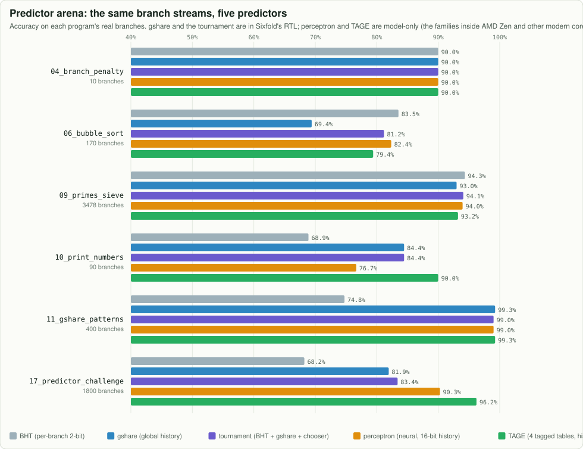

# From Sixfold to a modern CPU

What the cores inside today's laptops and servers do, which of those ideas Sixfold already has, and
what could come next. Numbers in brackets refer to [REFERENCES.md](REFERENCES.md).

| idea | what it does | used in | Sixfold |
|---|---|---|---|
| **Pipelining** | overlap the steps of many instructions | every CPU since the 1980s | 6 stages |
| **Caches** | small fast copies of slow memory [30] | every CPU | 4 KiB I + 4 KiB D, 2-way, LRU |
| **Hardware prefetching** | fetch lines before they are asked for; next-line and stride detectors [34] | Intel, AMD, ARM | next-line, both caches |
| **Branch target buffer** | know *where* a taken branch goes while still fetching it | every high-performance CPU | 16 entries |
| **Return address stack** | predict `ret` | every high-performance CPU | 8 entries |
| **Tournament predictor** | per-branch + global predictor with a chooser [28] | Alpha 21264 (1998) | yes |
| **Perceptron predictor** | a tiny neural network per branch [6] | AMD Zen / Zen+ (hashed perceptron) [35] | model only (arena) |
| **TAGE** | tagged tables with geometric history lengths; the longest match wins [7][36] | AMD Zen 2 onward, Intel, ARM [35][37] | model only (arena) |
| **Indirect branch predictor** | predict targets of `jalr` that are not returns [38] | Intel, AMD (indirect target array) | no: such a `jalr` flushes |
| **Traps** | `ecall`, exceptions, `mret`: how an OS takes control [31] | every CPU | machine mode |
| **Macro-op fusion** | decode two adjacent instructions as one (e.g. compare + branch) [39] | Intel Core, AMD Zen | idea: `lui` + `addi`, `auipc` + `jalr` |
| **Micro-op cache / loop buffer** | keep already-decoded instructions to skip decoding [39] | Intel (since Sandy Bridge), AMD Zen | no |
| **Superscalar** | fetch, decode and execute several instructions per cycle | all desktop cores (4-8 wide) | no: 1 per cycle |
| **Out-of-order execution** | run instructions when their inputs are ready, not in program order [40] | all desktop cores | no: in order |
| **Register renaming + reorder buffer** | remove false dependences; retire in order for precise traps [41] | all out-of-order cores | no |
| **Memory disambiguation** | let loads pass earlier stores safely [42] | Intel, AMD | no |
| **Simultaneous multithreading** | two threads share one core's units [43] | Intel Hyper-Threading, AMD SMT | no |

## The predictor arena

`node tools/predictor_arena.mjs` replays each program's real branch stream (every conditional branch
resolved in EXECUTE on the performance build) through five predictors in
[`model/predictors.js`](../model/predictors.js). It is **trace-driven**: every predictor learns the
outcome right after its guess, which is slightly optimistic compared with a pipeline, where a few
younger branches are predicted before an older one resolves.

What it shows:

* On short, simple programs the plain per-branch table (BHT) often wins: the history-based
  predictors spend their few branches warming up.
* On `17_predictor_challenge.s`, where one branch depends on the two before it, history wins:
  BHT 68%, gshare 82%, tournament 83%, perceptron 90%, TAGE 96%.
* That is why real cores layer predictors: AMD's Zen 2 kept Zen's hashed perceptron and added a TAGE
  predictor behind it, and AMD reported about 30% fewer mispredictions [35].

[Full table](img/charts/predictor_arena.md). The site has the same race, animated.

## What could come next in Sixfold

1. **TAGE in the RTL**: the arena says it is worth it for correlated branches. Four tagged tables of
   128 entries is about 7 Kbit of storage; the challenge is fitting the lookup into FETCH1's cycle.
2. **Indirect target prediction** for `jalr` through a register (function pointers, `switch`).
3. **Stride prefetching**: remember the address step of each load instruction and fetch ahead.
4. **Macro-op fusion** of `lui` + `addi` (every `li` of a large constant) and `auipc` + `jalr` (every `call` far away).
5. **Dual issue**: two instructions per cycle when they are independent, the first step toward
   superscalar; CPI can then drop **below** 1.
