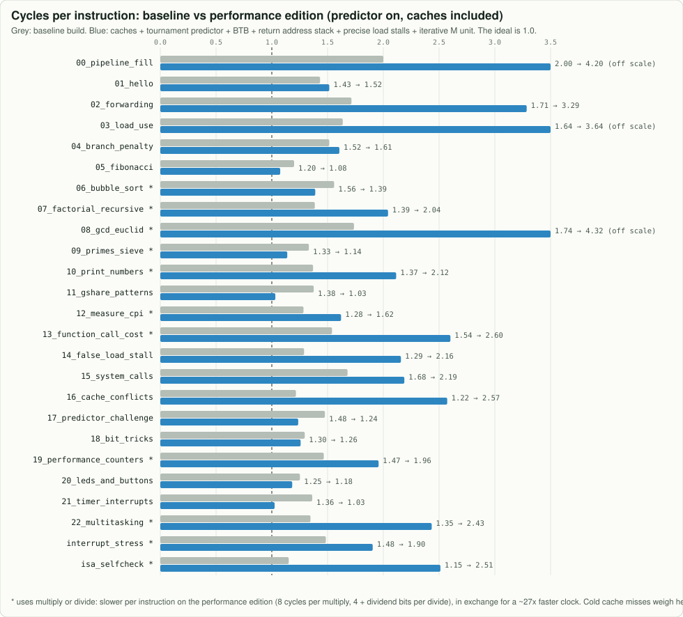

# Performance: pushing CPI toward 1 and the clock up

This page records how the "performance edition" of the core was built from the original EECS 151
design, what each change bought, and what it cost. Every number is measured by a script in this
repository, and every behavioural change is verified cycle by cycle against the RTL by `make test`,
which builds **both** designs.

| build | how to get it | what it is |
|---|---|---|
| **performance** (default) | `make test`, `make run PROG=...` | all features below enabled, 6 history bits |
| **baseline** | `-DBASELINE`, `CONFIG=baseline` | the original EECS 151 behaviour widened to RV64: no BTB, no return stack, field-based load stalls, single-cycle M unit, 4 history bits |

Each feature is a parameter of [`src/Riscv64.sv`](../src/Riscv64.sv), so you can switch any one
off and measure it on its own: `BTB_ENABLE`, `RAS_ENABLE`, `PRECISE_LOAD_STALL`,
`ITERATIVE_MULTIPLY_DIVIDE`, `GSHARE_HISTORY_BITS`.

## The result



| program | M ops | original: cycles | CPI | performance: cycles | CPI | run time, original (7.5 MHz) | run time, performance (207 MHz) | speed-up |
|---|:-:|---:|---:|---:|---:|---:|---:|---:|
| `00_pipeline_fill` |  | 10 | 2.00 | 10 | **2.00** | 1.3 µs | 0.05 µs | 27.6x |
| `01_hello` |  | 139 | 1.43 | 125 | **1.29** | 18.5 µs | 0.60 µs | 30.7x |
| `02_forwarding` |  | 12 | 1.71 | 12 | **1.71** | 1.6 µs | 0.06 µs | 27.6x |
| `03_load_use` |  | 18 | 1.64 | 18 | **1.64** | 2.4 µs | 0.09 µs | 27.6x |
| `04_branch_penalty` |  | 50 | 1.52 | 42 | **1.27** | 6.7 µs | 0.20 µs | 32.9x |
| `05_fibonacci` |  | 366 | 1.20 | 317 | **1.04** | 48.8 µs | 1.53 µs | 31.9x |
| `06_bubble_sort` | yes | 1,124 | 1.56 | 1,022 | **1.42** | 149.9 µs | 4.94 µs | 30.4x |
| `07_factorial_recursive` | yes | 327 | 1.39 | 385 | **1.63** | 43.6 µs | 1.86 µs | 23.4x |
| `08_gcd_euclid` | yes | 33 | 1.74 | 65 | **3.42** | 4.4 µs | 0.31 µs | 14.0x |
| `09_primes_sieve` | yes | 19,773 | 1.33 | 16,800 | **1.13** | 2636.4 µs | 81.16 µs | 32.5x |
| `10_print_numbers` | yes | 737 | 1.37 | 986 | **1.83** | 98.3 µs | 4.76 µs | 20.6x |
| `11_gshare_patterns` |  | 1,519 | 1.38 | 1,121 | **1.02** | 202.5 µs | 5.42 µs | 37.4x |
| `12_measure_cpi` | yes | 122 | 1.28 | 126 | **1.33** | 16.3 µs | 0.61 µs | 26.7x |
| `13_function_call_cost` | yes | 166 | 1.52 | 227 | **2.08** | 22.1 µs | 1.10 µs | 20.2x |
| `14_false_load_stall` |  | 25 | 1.32 | 24 | **1.26** | 3.3 µs | 0.12 µs | 28.8x |
| `isa_selfcheck` | yes | 7,420 | 1.16 | 12,644 | **1.97** | 989.3 µs | 61.08 µs | 16.2x |

Geometric-mean speed-up over all 16 programs: **26.0x** (clock and CPI together).

Clock rates: see *Frequency* below. The original design's single-cycle multiply/divide unit limits a
chip that must run M instructions to about 7.5 MHz; without the M extension (as in the RV32I
tape-out) the same pipeline reaches about 242 MHz on the same flow, and the programs without M
instructions would then run about 1.2x faster on the baseline than on the performance edition's
207 MHz clock, cycle counts aside.

## Part 1: cycles per instruction

`cycles = N + 5 + L + 3F + R + K` ([MATH.md](MATH.md)) says exactly where the cycles above 1 per
instruction come from. Each change below removes one term, or makes it cheaper.

| change | term it attacks | how | cost |
|---|---|---|---|
| **Branch Target Buffer** (`src/Branch_Target_Buffer.sv`) | R: 1 bubble per taken branch / JAL | 16 entries remember "the instruction at this PC jumped to that PC"; FETCH1 redirects immediately, with the gshare counter deciding the direction | 960 flip-flops; FETCH1's next-PC mux gets one more input |
| **Return Address Stack** (`src/Return_Address_Stack.sv`) | F: every `ret` flushed 3 | calls push PC + 4 in FETCH2, returns pop and redirect (1 bubble); EXECUTE only flushes if the prediction was wrong; the stack pointer is checkpointed and restored on flushes | 8 x 64-bit entries |
| **Precise load stalls** | L: false stalls | `ControlUnit` now reports `USES_REGISTER1/2`; `LOAD_STALL` ignores fields an instruction does not read | a few gates |
| **6 history bits** (was 4) | F: branch mispredictions | 64 counters instead of 16; see the [history sweep](img/charts/predictor_sweep.svg) | 3.7x the predictor area |

Measured examples (gshare on):

* `11_gshare_patterns`: CPI **1.38 → 1.02**. The BTB turns 398 redirect bubbles into zero.
* `09_primes_sieve`: CPI **1.33 → 1.13**. 3,572 taken branches now cost nothing; only 5 redirect bubbles remain.
* `12_measure_cpi`: the loop the program times itself runs at CPI **1.25 → 1.03**.
* `13_function_call_cost`: 8 calls cost **56 → 33** extra cycles (calls are free, returns cost 1).

What is left above 1.0 is mostly **load stalls** (a load followed immediately by its use: fix it in
software by scheduling, as `03_load_use.s` shows) and **wrong branch guesses** (3 cycles each).

## Part 2: frequency

### How it is measured

```bash
make timing        # tools/timing.sh performance && tools/timing.sh baseline
```

sv2v converts the SystemVerilog, Yosys synthesizes it without area-oriented rewriting, and ABC maps
it onto the SkyWater `sky130_fd_sc_hd` library (typical corner, 25 °C, 1.80 V) and reports the
longest register-to-register path. This is **logic only**: no wires, clock skew, setup time or slow
corner. After real place and route expect roughly 1.5x to 2.5x longer. For calibration, the EECS 151
chip was signed off at 26 ns in the slow corner, with caches, including wires.

### What changed

| step | path that limited the clock | logic delay |
|---|---|---:|
| original RTL, area-oriented flow | ALU ripple-carry adder into the store lanes | 12.8 ns |
| original RTL, timing-driven flow, M unit excluded | `EXECUTE_PC + 4` incrementer on the flush path | 4.6 ns |
| original single-cycle multiply/divide unit alone | 64 subtract steps in a row | **133 ns** |
| Kogge-Stone prefix adders in the ALU, branch comparator and FETCH2 target (`src/Parallel_Prefix_Adder.sv`); PC + 4 carried down the pipeline | | 4.1 ns (baseline build, M excluded) |
| **iterative multiply/divide unit** (`src/Iterative_Multiply_Divide_Unit.sv`): 64 x 16 bits per multiply step, 1 quotient bit per divide step, leading zeros skipped | the unit's setup, then its negation | 11.1 → 5.9 ns |
| negation as a prefix OR (`src/Prefix_Negate.sv`) instead of `~x + 1`; magnitudes taken one cycle earlier; return prediction checked against `rs1` instead of the ALU | | **4.8 ns (207 MHz)** |

The multiply/divide change is the big one: the single-cycle unit alone was 133 ns, bigger than the
rest of the core (465,000 µm²). Iterating trades cycles for clock rate: a multiply now takes 7
cycles, a divide 3 + the number of significant bits of the dividend (so `1234 / 10` takes 14, not 67).

### Why not 2.5 GHz?

A 2.5 GHz clock gives 400 ps per cycle. On sky130, measured with the same flow:

* one carry step of an adder (`maj3` cell): about **330 ps**;
* the first three gates of the ALU path, before any adding: about **480 ps**;
* the whole 64-bit ALU with its prefix adder and result multiplexer: **2.98 ns**.

So in this 130 nm process, even a pipeline that did one gate's worth of work per stage could not
reach 2.5 GHz. Application-class RISC-V cores that run at 2 GHz and above are built in far more
advanced processes (12 nm and below), whose gates are many times faster, with deep pipelines of
10 or more stages, custom-tuned critical circuits and careful floorplanning. What *does* carry over is
the method used here: measure the critical path, then either make it shallower (prefix adders,
prefix negation) or spread it over more cycles (the iterative M unit), and pay for the extra cycles
with better prediction (BTB, return stack).

### Ideas for the next step

* **Split EXECUTE**: the ALU result feeds the forwarding muxes into DECODE in the same cycle
  (the EECS 151 forwarding style). A 7-stage version would raise the clock and add a bubble to
  back-to-back dependent instructions.
* **Make the flush decision one cycle later** (resolve branches in MEMORY) and see whether the clock
  gain beats the extra bubble per wrong guess.
* **Radix-4 division** (2 quotient bits per step) to halve divide time at a small clock cost.
* **Real sign-off**: run OpenROAD/OpenLane on the sv2v output to get placed-and-routed numbers.
