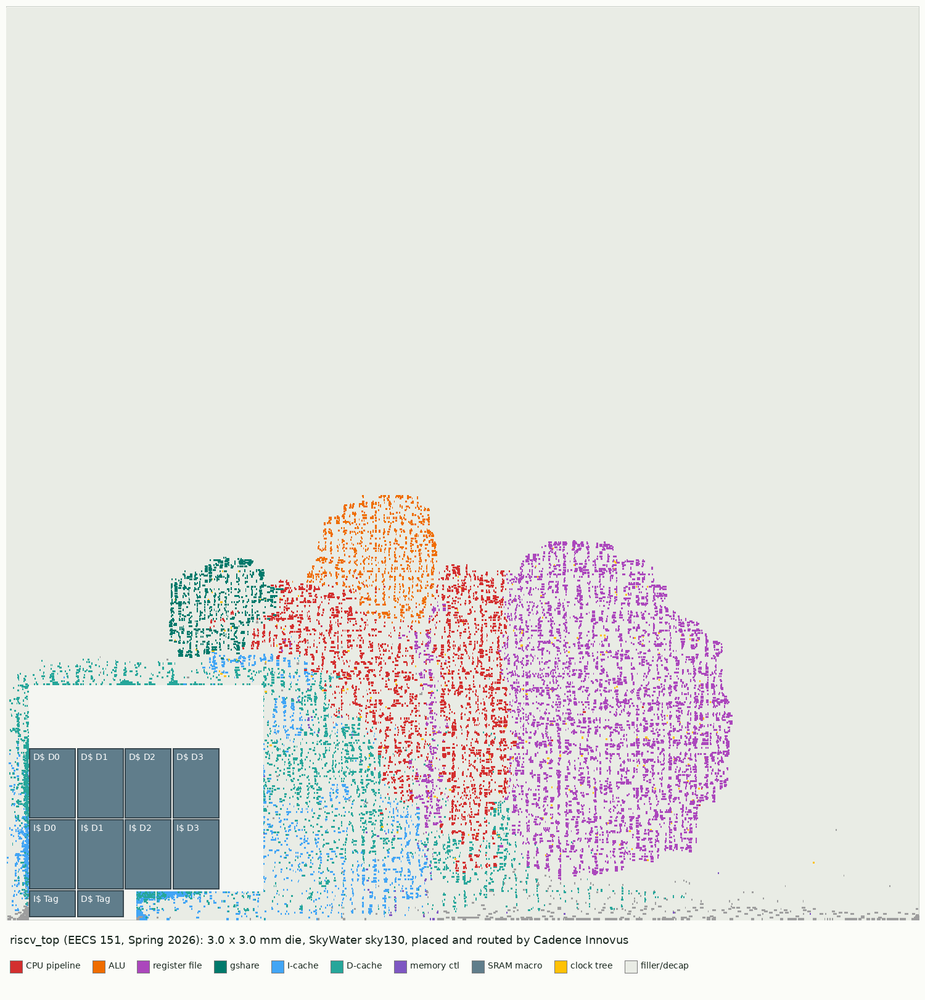
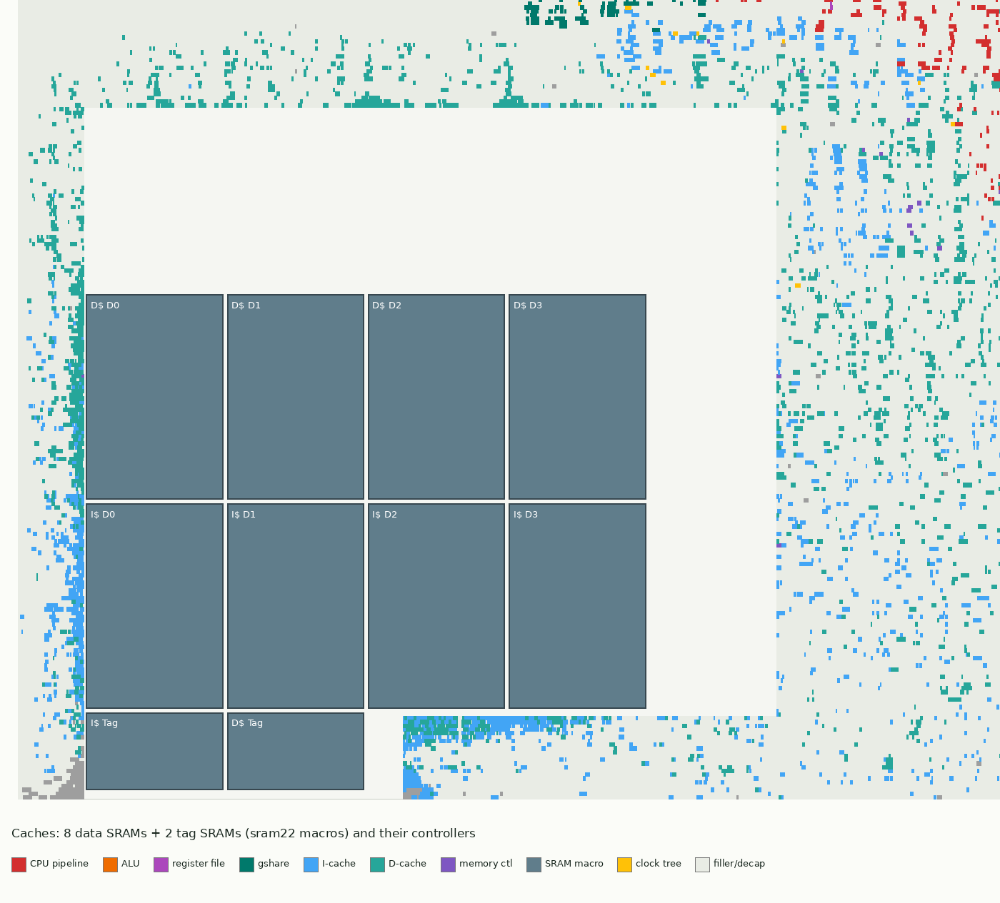
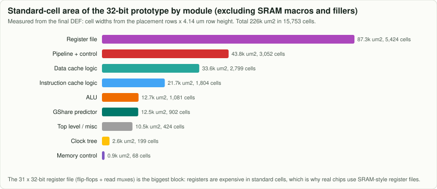
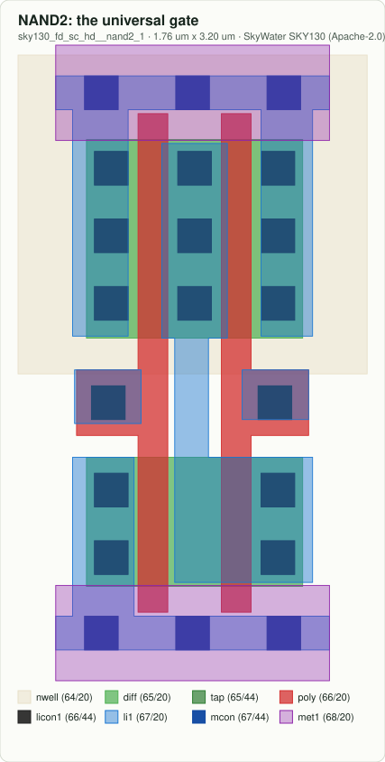
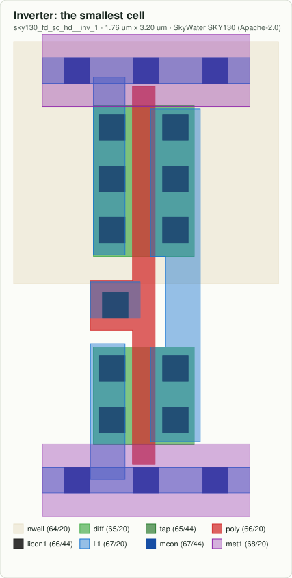

# Silicon: what this CPU looks like as a real chip

Everything on this page is real data: the original EECS 151 design's final layout and reports
(Cadence Innovus, SkyWater sky130), real sky130 standard-cell drawings, and open-source synthesis of
this repository's 64-bit RTL onto the sky130 high-density library.

## The whole die



A 3 mm x 3 mm die, but the logic covers only a few percent of it (cell density 2.8%): the rest is
filler and decoupling capacitors. The ten grey blocks at the lower left are SRAM macros from the
open-source sram22 generator: four data arrays and one tag array for each cache.

## The core


The placer groups cells that talk to each other. The register file (purple) is the largest block;
the pipeline logic (red) sits between it and the ALU (orange); the gshare predictor (teal) sits near
the fetch logic; the caches (blue and green) spread toward their SRAMs.

## The wiring


Five metal layers, alternating direction: met1 purple (inside cells), met2 blue (vertical), met3
green (horizontal), met4 orange (vertical, also over the SRAMs), met5 red (power and long wires).



These pictures are drawn by `tools/render_def.py` from the placed-and-routed DEF file: every
rectangle is one standard cell at its real position.

## Timing and area of the original chip




| metric | value |
|---|---|
| clock | 26 ns (38.5 MHz), setup slack +0.163 ns at ss / 100 C / 1.60 V |
| hold | slack +0.041 ns |
| cells | 15,753 standard cells, 10 SRAM macros |
| most used cells | AND2X1 2,177 · MX2X1 2,134 · DFFX1 1,720 |
| leakage | 0.030 mW |

The top of the cell list tells the story of a register-heavy design: thousands of 2-input
multiplexers (register file reads, forwarding) and 1,720 flip-flops (pipeline registers, register
file, counters).

## Standard cells up close

| | | |
|---|---|---|
|  |  |  |
|  |  |  |

Layer legend: nwell (beige) holds the PMOS transistors at the top; diffusion (green) is where
transistors form; polysilicon (red) is the gate; each red-over-green crossing is a transistor;
local interconnect (light blue) and metal 1 (purple) wire them up. Every cell in a library has the
same height, so cells can be placed side by side in rows sharing the power rails.

## This repository's 64-bit RTL on sky130

```bash
make synth     # downloads sv2v and the sky130_fd_sc_hd liberty file, then runs Yosys per module
```

| module | area (um2) | cells |
|---|---:|---:|
| RegisterFile (31 x 64-bit) | 109,461 | 6,971 |
| ALU (65-bit shared adder, shifters, W ops) | 14,703 | 2,684 |
| CSRFile (two 64-bit counters + registers) | 11,057 | 1,366 |
| BranchControl | 2,278 | 327 |
| GSharePredictor (4 bits) | 2,148 | 249 |
| LoadControl | 1,946 | 277 |
| BranchComparator | 1,545 | 240 |
| StoreControl | 1,025 | 147 |
| ControlUnit (+ALUdec) | 428 | 74 |
| ImmediateGenerator | 362 | 51 |

Typical corner, 25 C, 1.80 V library; area is the sum of cell areas before placement. The
`MultiplyDivideUnit` is left out: a single-cycle 64-bit divider is enormous, which is Lab 4.

GShare area versus history length:

| history bits | 2 | 4 | 6 | 8 | 10 |
|---|---:|---:|---:|---:|---:|
| area (um2) | 571 | 2,148 | 7,923 | 31,350 | 115,760 |

## Tools and flows

* Original: Hammer + Cadence Genus/Innovus at Berkeley (configs in
  [`original/eecs151-rv32i/physical-design/`](../original/eecs151-rv32i/physical-design)).
* Open source equivalent: OpenLane / OpenROAD-flow-scripts on the same sky130 PDK, after
  converting the SystemVerilog with sv2v.
