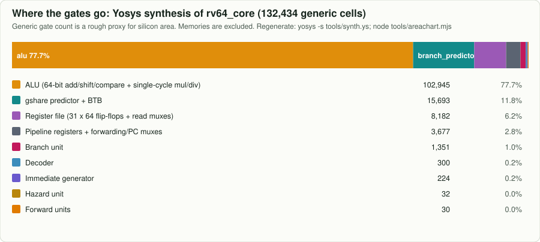
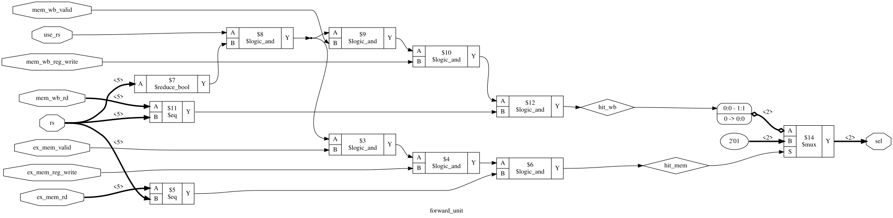
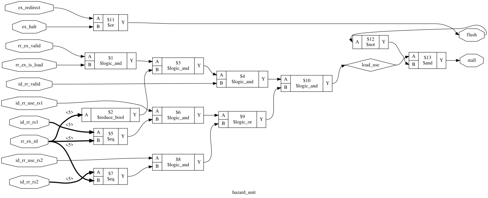

# From Verilog to silicon: what this CPU looks like physically

The RTL in `rtl/` is a description, not a chip. This page follows it down the same path a real
core takes, and points to photographs of real RISC-V silicon that went all the way.

## Step 1: synthesis, measured on this design

`make synth` runs Yosys on the core (memories excluded) and maps it to generic gates.
Result (`docs/synth_stat.txt`):

| part | generic cells | notes |
|---|---:|---|
| ALU | ~103,000 | the single-cycle 64-bit **multiplier and dividers** are almost all of it |
| gshare predictor + BTB | ~15,700 | 512 counter bits + 32 BTB entries of {tag, 64-bit target} in flip-flops |
| register file | ~8,200 | 31 x 64 = 1,984 flip-flops plus two 32-to-1 read multiplexers per bit |
| pipeline registers, muxes | ~3,700 | the five latches, forwarding and PC muxes |
| branch unit | ~1,350 | two 64-bit adders and comparators |
| decoder, imm gen, hazard, forward | ~590 | the entire "control" of the pipeline is tiny |

Two lessons that hold for real chips too:

1. **Control is cheap, datapath width is expensive.** Everything that makes this a *pipeline*
   (hazard unit, forward units, decoder) is well under 1% of the gates.
2. **Storage dominates once you add it.** In a real chip, caches built from SRAM macros usually
   take more area than the core logic. The Ariane test chip, for example, pairs the core with a
   16 kB instruction cache and 32 kB data cache **[11]**.

### Gate-level schematics

`make schematics` draws the small control modules as actual logic gates. These are the literal
circuits that decide forwarding and stalls:

| forward unit | hazard unit |
|---|---|
|  |  |

The immediate generator (`imm_gen.svg`) and branch unit (`branch_unit.svg`) are in
[`img/schematics/`](img/schematics/).

## Step 2 and 3: standard cells and layout

A standard-cell library provides pre-drawn transistor layouts for each gate (NAND2, DFF, MUX2
and so on), all the same height so they can be placed in rows. Place-and-route tools arrange
tens of thousands of them and connect them with metal wires. With the open SkyWater SKY130
process you can do this yourself with OpenLane **[20]**, and Tiny Tapeout **[20]** lets small
designs be manufactured on a shared chip.

This full core is far too large for a single Tiny Tapeout tile, mainly because of the
single-cycle divider and the register file in flip-flops. Pieces of it, such as the forward unit,
hazard unit, decoder or a small gshare predictor, fit easily and make good tape-out exercises.

## Step 4: real RISC-V silicon to look at

These chips implement the same ideas as this repo at production scale. Follow the links for die
photos and floorplans (images are the authors' copyright, so they are linked rather than copied):

| chip / core | what it is | relation to this design | where to see it |
|---|---|---|---|
| **Ariane / CVA6** | 6-stage, single-issue, in-order RV64, GF 22FDX, 3 mm x 3 mm die, up to 1.7 GHz | the closest real relative: same stage count, same ISA width, has BHT + BTB | floorplan and die in [11] (arXiv 1904.05442), RTL [12] |
| **Rocket** | 5-stage in-order RV64 | the textbook pipeline, one stage shorter | [15] |
| **SiFive U74** (7 series) | 8-stage, dual-issue, in-order RV64GC | deeper and 2-wide; in the StarFive JH7110 on the VisionFive 2 board | WikiChip 7 series page |
| **BOOM / BROOM** | out-of-order superscalar RV64, TSMC 28 nm test chip | what comes after in-order: renaming, reorder buffer, TAGE-style prediction | Hot Chips 30 slides [13], [14] |

What to look for in a die photo or floorplan:

* **Large regular rectangles** are SRAM arrays: caches, and in big cores the predictor tables.
* **The "sea of gates"** in between is synthesized standard-cell logic like this repo's RTL.
* **The ring at the edge** is input/output pads; the core is usually a small fraction of the die.
