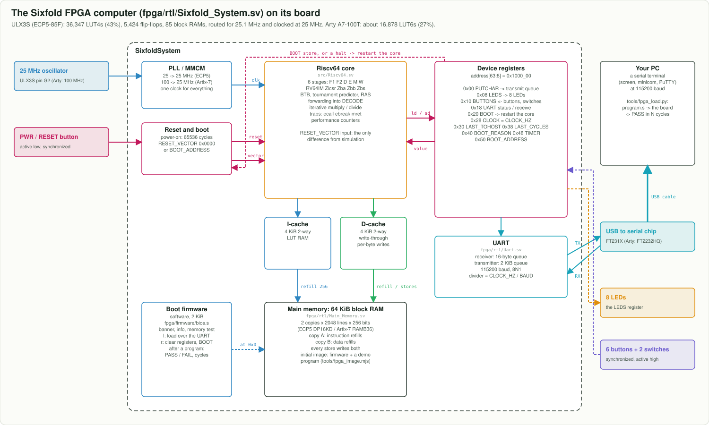

# ULX3S board sheet (for Sixfold)

A one-page summary of the board facts Sixfold depends on, gathered from the manufacturer's material. This
is **not** the official datasheet. For anything electrical, check the documents under
[Official documents](#official-documents).



## The board

| | ULX3S v3.x (Radiona.org, open hardware) |
|---|---|
| FPGA | Lattice ECP5 **LFE5U-85F-6BG381C** (also sold with 12F and 45F; Sixfold needs the **85F**) |
| Logic | 83,640 LUT4 + 83,640 flip-flops (nextpnr's count for the 85F) |
| Block RAM | 208 x 18 Kbit (DP16KD) = 3,744 Kbit |
| Multipliers | 156 x (18 x 18) (MULT18X18D) |
| Clock | 25 MHz oscillator on pin **G2**; 4 PLLs (EHXPLLL) in the FPGA |
| USB | **FTDI FT231XS**: USB serial port (up to 3 Mbit/s) and JTAG programming, on connector US1 |
| Memory on the board | 32 MB SDRAM (166 MHz), 4 to 16 MB quad-SPI flash (holds the configuration) |
| User I/O | 8 LEDs, 7 buttons (PWR, FIRE1, FIRE2, UP, DOWN, LEFT, RIGHT), 4 DIP switches |
| Other | ESP32-WROOM-32 (Wi-Fi), GPDI digital video, micro-SD, 3.5 mm jack, 8-channel ADC (MAX11125), real-time clock (MCP7940N), 56 GPIO pins |
| Size | 94 mm x 51 mm, powered from USB |

## Pins Sixfold uses

From the official constraints file `ulx3s_v20.lpf`; copied into
[`fpga/boards/ulx3s/ulx3s.lpf`](../../fpga/boards/ulx3s/ulx3s.lpf). All pins are LVCMOS33.

| Signal | Pin | Direction | Sixfold |
|---|---|---|---|
| `clk_25mhz` | G2 | in | PLL input; the system runs at 25 MHz (`CLOCK_MHZ`, see FPGA.md) |
| `ftdi_txd` | M1 | in | UART receive (the PC sends) |
| `ftdi_rxd` | L4 | out | UART transmit (the PC receives) |
| `wifi_gpio0` | L2 | out | held at 1, so the ESP32 leaves the FPGA alone |
| `led[0..7]` | B2 C2 C1 D2 D1 E2 E1 H3 | out | `LEDS` register (0x1000_0008) |
| `btn[0]` (PWR) | D6 | in, pressed = 0 | reset: back to the boot firmware |
| `btn[1..6]` | R1 T1 R18 V1 U1 H16 | in, pressed = 1 | `BUTTONS[5:0]` (0x1000_0010) |
| `sw[0..1]` | E8 D8 | in | `BUTTONS[7:6]` |

## Build and program

```
sudo apt install yosys nextpnr-ecp5 fpga-trellis openfpgaloader   # the open-source flow (Ubuntu 24.04)
make fpga-ulx3s PROG=20_leds_and_buttons                           # about 8 minutes
openFPGALoader -b ulx3s build/ulx3s/sixfold.bit                     # into the FPGA (lost at power-off)
openFPGALoader -b ulx3s -f build/ulx3s/sixfold.bit                  # into the flash (kept)
```

Then open the serial port at 115200 baud (`screen /dev/ttyUSB0 115200`, or PuTTY on Windows) and press
**PWR** for the banner, or load a program with `python3 tools/fpga_load.py programs/05_fibonacci.s`.
[docs/FPGA.md](../FPGA.md) walks through it.

## Official documents

* Board: [github.com/emard/ulx3s](https://github.com/emard/ulx3s) (schematics, constraints files, manual)
  and [radiona.org/ulx3s](https://radiona.org/ulx3s/); product page at
  [Crowd Supply](https://www.crowdsupply.com/radiona/ulx3s)
* Constraints file: [`doc/constraints/ulx3s_v20.lpf`](https://github.com/emard/ulx3s/blob/master/doc/constraints/ulx3s_v20.lpf)
* FPGA: Lattice [ECP5 and ECP5-5G Family Data Sheet (FPGA-DS-02012)](https://www.latticesemi.com/Products/FPGAandCPLD/ECP5)
  and the sysCLOCK PLL and sysMEM block RAM usage guides on the same page
* Toolchain: [Project Trellis](https://github.com/YosysHQ/prjtrellis), [nextpnr](https://github.com/YosysHQ/nextpnr),
  [openFPGALoader](https://github.com/trabucayre/openFPGALoader)
