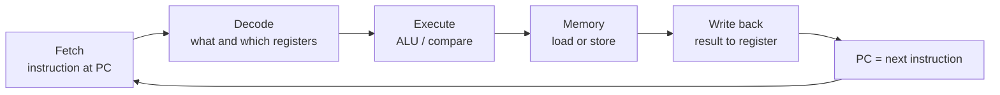
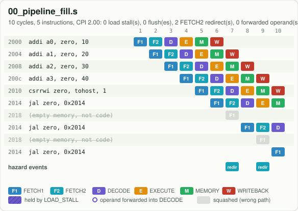

# 1. What a CPU does

A Central Processing Unit (CPU) repeats one loop, billions of times per second:

1. **Fetch**: read the next instruction from memory, at the address held in the Program Counter (PC).
2. **Decode**: work out what the instruction asks for (add? load? jump?) and which registers it uses.
3. **Execute**: do the arithmetic, compare, or compute a memory address.
4. **Memory**: for loads and stores, read or write the data memory.
5. **Write back**: put the result into the destination register.
6. Move the PC to the next instruction (PC + 4, or a jump target) and start again.



## Registers, memory and the clock

* **Registers**: 32 small, very fast storage slots, `x0` to `x31`, each 64 bits wide on this RV64 CPU.
  `x0` always reads 0. Software gives them nicknames (Application Binary Interface (ABI) names):
  `a0` is `x10`, `sp` is `x2`, `ra` is `x1`, and so on.
* **Memory**: a big array of bytes. Here it is 64 KiB (kibibytes); programs start at address `0x2000`,
  exactly like the EECS 151 project this design grew from.
* **The clock**: a square wave. On every rising edge each flip-flop in the chip captures its new value.
  Everything a CPU "does" happens between two clock edges.

## Doing the steps one after another is slow, so overlap them

If one instruction had to finish all six steps before the next could start, most of the hardware
would sit idle most of the time. A **pipeline** works like a laundry: while one load is in the dryer,
the next is in the washer. This CPU has six stages, so up to six instructions are in flight at once.



Read the chart above like a timetable: **rows are instructions, columns are clock cycles**, and each
coloured box says which stage the instruction is in during that cycle. The first instruction needs
6 cycles to finish (the *latency*), but after that one instruction finishes **every** cycle (the
*throughput*). That staircase is the single most important picture in computer architecture.

## Try it

```bash
make pipe PROG=00_pipeline_fill     # the same chart, in your terminal
make run  PROG=00_pipeline_fill     # the final register values: a0 = 10, a1 = 20, ...
```

Then open the [web simulator](../../web/index.html), choose `00 pipeline fill` and press **Step**
six times while watching the stage boxes.

Next: [2. Instructions are just 32 bits](02_instructions_in_binary.md)
