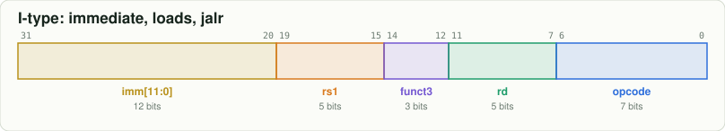
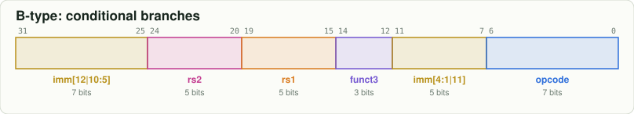

# 2. Instructions are just 32 bits

Every RISC-V instruction on this CPU is exactly 32 bits. The lowest 7 bits, the **opcode**, say
which family it belongs to; the other fields say which registers and what constant to use.




The trick that makes decoding cheap: **register numbers always sit in the same place**.
`rd` is bits 11:7, `rs1` is bits 19:15, `rs2` is bits 24:20, in every format that has them.
That is why `src/Riscv64.sv` can read the register file in DECODE before it even knows what
the instruction is:

```systemverilog
assign DECODE_REGISTER1_ADDRESS = DECODE_INSTRUCTION[19:15]; // Register 1 Address (rs1) is always the 5 bits at 19-15
assign DECODE_REGISTER2_ADDRESS = DECODE_INSTRUCTION[24:20]; // Register 2 Address (rs2) is always the 5 bits at 24-20
```

## Decode one by hand

`add a0, a1, a2` assembles to `0x00c58533`:

| funct7 | rs2 | rs1 | funct3 | rd | opcode |
|---|---|---|---|---|---|
| `0000000` | `01100` = x12 = a2 | `01011` = x11 = a1 | `000` = ADD | `01010` = x10 = a0 | `0110011` = OP (register-register) |

```bash
node tools/rv.mjs encode "add a0, a1, a2"
node tools/rv.mjs decode 0x00c58533
```

## Why do branch immediates look scrambled?



The sign of every immediate is always bit 31, and each immediate bit that appears in several formats
sits in the same instruction bit. The hardware
([`src/Immediate_Generator.sv`](../../src/Immediate_Generator.sv)) then becomes plain wiring
instead of a big multiplexer. Branch targets are always even, so bit 0 is not stored at all.

## Every instruction has its own page

The [`binary/`](../../binary/README.md) folder has one page per instruction (104 of them): its bit
pattern, an example encoding, **the exact control signals the `ControlUnit` produces for it**
(with the same names as the RTL, like `ALU_INPUT_B_IS_IMMEDIATE`), and its journey through the six
stages. For example [`beq`](../../binary/RV64I/beq.md) or [`ld`](../../binary/RV64I/ld.md).

## Newer instructions: the B extension (Zba, Zbb, Zbs)

Besides RV64I, M and Zicsr, Sixfold implements **Zba** (address generation, like `sh3add a0, a1, a2`
= `a2 + a1 * 8`, the address of element `a1` of an array of 8-byte values) and **Zbb** (bit
manipulation: `clz`, `ctz`, `cpop`, `rev8`, `orc.b`, `min`, `max`, rotates, ...). They are in every
current RISC-V application processor. Most reuse existing formats; the one-operand ones (`clz a0, a1`)
put a 12-bit operation code where an immediate would go ([`clz`](../../binary/Zbb/clz.md)).
**Zbs** works on single bits: `bset`, `bclr`, `binv` and `bext` set, clear, flip or read bit `rs2`
(or an immediate bit number: [`bseti`](../../binary/Zbs/bseti.md) reuses the shift-immediate format, with
the bit number where a shift amount would go). Together the three are the **B** extension.
Try them in the "Bit tricks" section of the site.

Next: [3. The six stages and how to read the diagrams](03_the_six_stages.md)
