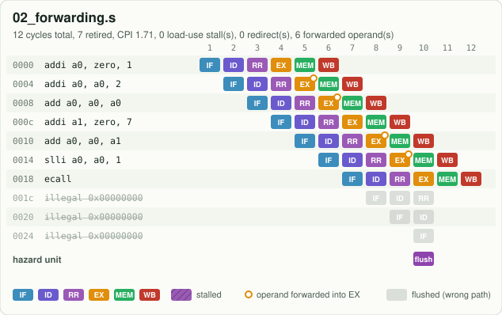
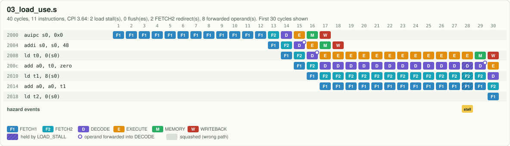

# 4. Data hazards: forwarding and load stalls

```asm
addi a0, a0, 2      # writes a0 ...
add  a0, a0, a0     # ... and the very next instruction reads it
```

When `add` is in DECODE reading the register file, `addi` is only in EXECUTE: its result exists
but has not been written back yet. Reading the register file would give the **old** `a0`. This is a
**data hazard**.

## Fix 1: forwarding (no lost cycles)

Like the EECS 151 Riscv151 design, this CPU forwards **into DECODE**. Each source register goes
through a priority chain and the newest value wins:

```text
x0  >  EXECUTE (not a load)  >  MEMORY  >  WRITEBACK  >  register file
```

```systemverilog
end else if (EXECUTE_VALID && EXECUTE_REGISTER_WRITE_ENABLE && !EXECUTE_MEMORY_READ_ENABLE && (EXECUTE_DESTINATION_REGISTER_ADDRESS != 5'd0) && (EXECUTE_DESTINATION_REGISTER_ADDRESS == DECODE_REGISTER1_ADDRESS)) begin
  DECODE_FORWARDED_REGISTER1_DATA = EXECUTE_FORWARD_DATA; // Data Hazard: Forward Execute Data to Decode Stage
```



Every ring in this chart is a forwarded operand; the chain of six dependent instructions runs with
**zero** stalls.

## Fix 2: the load stall (1 lost cycle)

A load reads memory at the end of EXECUTE; its data only exists in MEMORY. If the instruction right
behind it needs the loaded register, there is nothing to forward yet. `LOAD_STALL` holds FETCH1,
FETCH2 and DECODE for one cycle and sends a bubble (a NOP) into EXECUTE. One cycle later the load
is in MEMORY and its data is forwarded.



Program [`03_load_use.s`](../../programs/03_load_use.s) shows two stalls in the naive order and zero
after moving an independent instruction into the gap, which is exactly what compilers do
(*instruction scheduling*).

## The false stall

`LOAD_STALL` compares the rs1 and rs2 **fields** of the instruction in DECODE, even when that
instruction does not really read those registers. In `addi a1, zero, 5` the immediate's low bits
sit where rs2 would be, and 5 means `x5` = `t0`. Right after `ld t0, ...` that causes a stall for
nothing. Program [`14_false_load_stall.s`](../../programs/14_false_load_stall.s) measures it
(4 cycles instead of 3) and [Lab 5](../EXPERIMENTS.md) fixes it.

Next: [5. Control hazards and branch prediction](05_branch_prediction.md)
