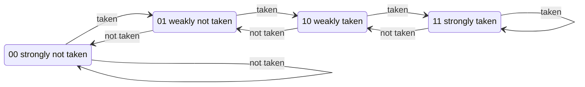

# 5. Control hazards and branch prediction

A branch is only **resolved** in EXECUTE (stage 4), but FETCH1 has to choose the next address every
single cycle. Waiting would cost 3 cycles per branch, so the CPU **guesses** and fixes wrong guesses.

## Two places a guess is made, one place it is checked

| where | what | cost |
|---|---|---|
| FETCH1 | `GSharePredictor` reads a 2-bit counter: "if this turns out to be a branch, will it be taken?" | none |
| FETCH2 | the instruction is known. A predicted-taken branch or any JAL: compute `PC + imm` and **redirect** FETCH1 there | 1 bubble (the instruction fetched behind it is squashed) |
| EXECUTE | `BranchControl` compares the guess with the real outcome. Wrong, or any JALR: **flush** FETCH1, FETCH2, DECODE | 3 bubbles |


In this chart `jal` (a function call) squashes one instruction and `ret` (a JALR, whose target is in
a register) squashes three.

## The 2-bit saturating counter

One wrong guess should not immediately flip the prediction (think of a loop branch that is taken
99 times and not taken once). Each counter therefore needs two wrong guesses in a row to change its mind:



Counters reset to `10` (weakly taken), the choice made in the EECS 151 design: most branches in real
code are loop branches, which are usually taken.

## gshare: PC xor history

```text
index = PC[5:2]  XOR  GLOBAL_HISTORY_REGISTER      (4 bits -> 16 counters)
```

The Global History Register (GHR) holds the directions of the last 4 branches. XOR-ing it with the
PC means the **same branch uses different counters in different situations**. A branch that
alternates taken, not taken, taken, ... confuses a single counter, but with history each counter sees
a constant pattern. Program [`11_gshare_patterns.s`](../../programs/11_gshare_patterns.s):
2106 cycles with the predictor off, 1519 with gshare.

Keeping the history correct needs care: FETCH2 shifts in the **predicted** direction immediately
(so the next branch can use it), and each instruction carries a **checkpoint** of the history. On a
flush, EXECUTE restores the checkpoint plus the real outcome, erasing the history written by
wrong-path branches.

## How long should the history be?


More history distinguishes more situations but spreads training over more counters (each needs its
own warm-up) and the table grows as 2^bits. The 4-bit tape-out value is best for the prime sieve;
bubble sort prefers 6. Chapter 7 shows what each extra bit costs in silicon.

```bash
make bp PROG=06_bubble_sort       # the whole sweep for one program
```

Next: [6. Measuring performance](06_performance.md)
