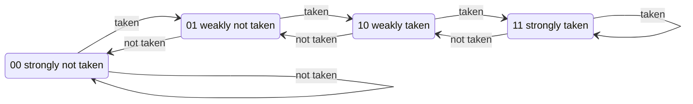

# 5. Control hazards and branch prediction

A branch is only **resolved** in EXECUTE (stage 4), but FETCH1 has to choose the next address every
single cycle. Waiting would cost 3 cycles per branch, so the CPU **guesses** and fixes wrong guesses.

## Two places a guess is made, one place it is checked

| where | what | cost |
|---|---|---|
| FETCH1 | `GSharePredictor` reads a 2-bit counter: "if this turns out to be a branch, will it be taken?" | none |
| FETCH2 | the instruction is known. A predicted-taken branch or any JAL: compute `PC + imm` and **redirect** FETCH1 there | 1 bubble (the instruction fetched behind it is squashed) |
| EXECUTE | `BranchControl` compares the guess with the real outcome. Wrong, or any JALR: **flush** FETCH1, FETCH2, DECODE | 3 bubbles |


In this chart `jal` (a function call) squashes one instruction and `ret` (a JALR, whose target is in
a register) squashes three.

## The 2-bit saturating counter

One wrong guess should not immediately flip the prediction (think of a loop branch that is taken
99 times and not taken once). Each counter therefore needs two wrong guesses in a row to change its mind:



Counters reset to `10` (weakly taken): most branches in real
code are loop branches, which are usually taken.

## gshare: PC xor history

```text
index = PC[5:2]  XOR  GLOBAL_HISTORY_REGISTER      (4 bits -> 16 counters)
```

The Global History Register (GHR) holds the directions of the last 4 branches. XOR-ing it with the
PC means the **same branch uses different counters in different situations**. A branch that
alternates taken, not taken, taken, ... confuses a single counter, but with history each counter sees
a constant pattern. Program [`11_gshare_patterns.s`](../../programs/11_gshare_patterns.s):
2106 cycles with the predictor off, 1519 with gshare (original design; 1121 on the performance edition, whose Branch Target Buffer also removes the 1-cycle redirects).

Keeping the history correct needs care: FETCH2 shifts in the **predicted** direction immediately
(so the next branch can use it), and each instruction carries a **checkpoint** of the history. On a
flush, EXECUTE restores the checkpoint plus the real outcome, erasing the history written by
wrong-path branches.

## How long should the history be?


More history distinguishes more situations but spreads training over more counters (each needs its
own warm-up) and the table grows as 2^bits. 4 bits is best for the prime sieve on the baseline;
bubble sort prefers 6. Chapter 7 shows what each extra bit costs in silicon.

```bash
make bp PROG=06_bubble_sort       # the whole sweep for one program
```

## Two predictors and a referee: the tournament

gshare learns patterns across branches but warms up slowly; a plain per-branch **Branch History
Table** (BHT, one 2-bit counter per branch address) learns fast but cannot see patterns. The
performance edition keeps both and adds a **chooser**: one more 2-bit counter per branch that moves
toward whichever predictor was right whenever they disagree
([`src/Tournament_Chooser.sv`](../../src/Tournament_Chooser.sv)). This is the design of the Alpha
21264 (1998), still the textbook example of a "combining" predictor.

## Knowing *where* before knowing *what*: the BTB

A predicted-taken branch still cost 1 bubble, because the target `PC + imm` is only known in
FETCH2. The **Branch Target Buffer** ([`src/Branch_Target_Buffer.sv`](../../src/Branch_Target_Buffer.sv))
remembers "the instruction at this PC jumped to that PC" and lets FETCH1 jump immediately, and the
**Return Address Stack** predicts `ret`.

## Beyond: perceptrons and TAGE

Today's cores go further: AMD's Zen used a **perceptron** (a tiny neural network per branch that
weighs every bit of history) and Zen 2 added **TAGE** (tables indexed with longer and longer
histories; the longest one that recognises the situation wins). Both are in the **predictor arena**
([`model/predictors.js`](../../model/predictors.js), [MODERN_CPUS.md](../MODERN_CPUS.md)), which
replays a program's real branches through all five predictors. On `17_predictor_challenge.s` TAGE
reaches 96% where a per-branch table manages 68%.

Next: [6. Measuring performance](06_performance.md)
