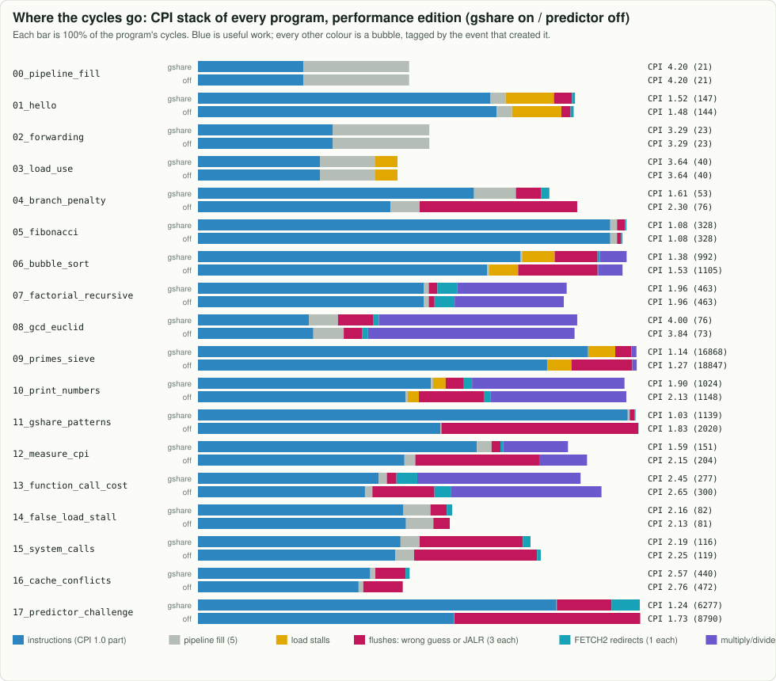
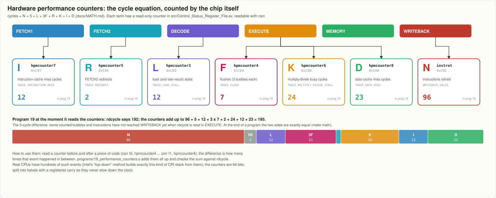

# 6. Measuring performance

## CPI

**Cycles Per Instruction (CPI)** = cycles / instructions. A perfect pipeline has CPI 1.0; every
bubble pushes it up. Run time = instructions x CPI x clock period.

## Every cycle is accounted for

The model tags each bubble with the event that created it, so this equation holds **exactly** for
every program (`make math` checks all 30 runs):

```text
cycles = N + 5 + L + 3F + R + K + I + D
       (K: multiply/divide busy, I: instruction-cache miss, D: data-cache miss; performance edition)
          |   |   |    |    +-- FETCH2 redirects that survived (1 bubble each)
          |   |   |    +------- flushes from EXECUTE: wrong guesses and JALRs (3 bubbles each)
          |   |   +------------ load stalls (1 bubble each)
          |   +---------------- filling the 6-stage pipeline once
          +-------------------- instructions retired
```



Blue is useful work; every other colour is a type of bubble. Look for which colour dominates a
program: that is the hazard worth fixing first.

## A program that measures itself

The `CSRFile` has two read-only counters, `cycle` and `instret`.
[`12_measure_cpi.s`](../../programs/12_measure_cpi.s) reads both before and after a loop:

```asm
rdcycle   s0            # start the stopwatch
rdinstret s1
loop: ...
rdcycle   s2            # stop it
rdinstret s3
```

A subtle point that real hardware shares: the counters are **read** in EXECUTE but `instret`
**counts** in WRITEBACK, so instructions still in flight around the reads land inside the window.
That is why benchmarks time long loops.


## Caches: fast copies of slow memory

Main memory takes 10 cycles to deliver a 32-byte line, so Sixfold keeps a 4 KiB instruction cache
and a 4 KiB data cache next to the pipeline. An address is split into a **tag** (bits 31:11), a
**set index** (bits 10:5) and an **offset** (bits 4:0). Each of the 64 sets holds two lines (two
**ways**); when both are full, the **least recently used** line is replaced.

[`16_cache_conflicts.s`](../../programs/16_cache_conflicts.s) reads arrays exactly 2 KiB apart, so
they all fall into the same sets. Two arrays fit in the two ways (only the first pass misses);
three arrays **thrash**: every load evicts the line needed next. Watch it happen in the
"Inside the caches" section of the site.

```bash
make run PROG=16_cache_conflicts     # a0 = cycles with 2 arrays, a1 = with 3
```

## Counters for every kind of bubble

Sixfold also has six **performance counters**, one per term of the cycle equation:
`hpmcounter3` load stalls (L), `hpmcounter4` flushes (F), `hpmcounter5` redirects (R), `hpmcounter6`
multiply/divide busy cycles (K), `hpmcounter7` and `hpmcounter8` instruction- and data-cache miss cycles
(I and D). [`19_performance_counters.s`](../../programs/19_performance_counters.s) reads them all and adds
them up; the result lands within a few cycles of `rdcycle` (the rest is still in flight). This is how
performance engineers work on real chips: Intel calls it "top-down analysis".



Next: [7. From RTL to silicon](07_silicon.md)
