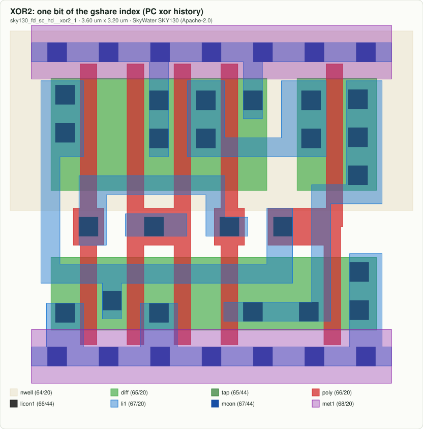
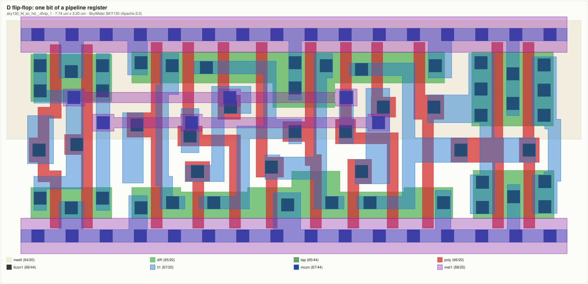
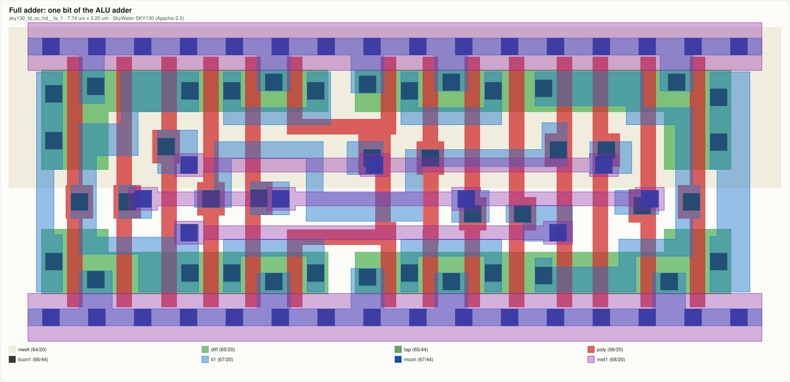
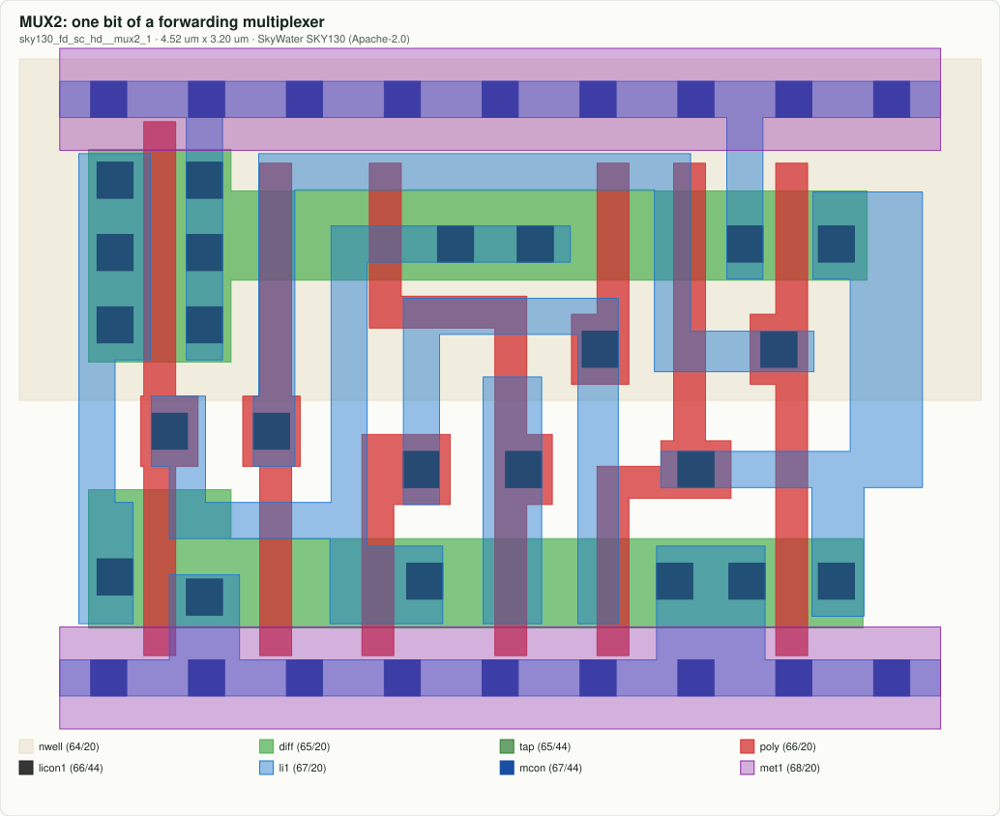
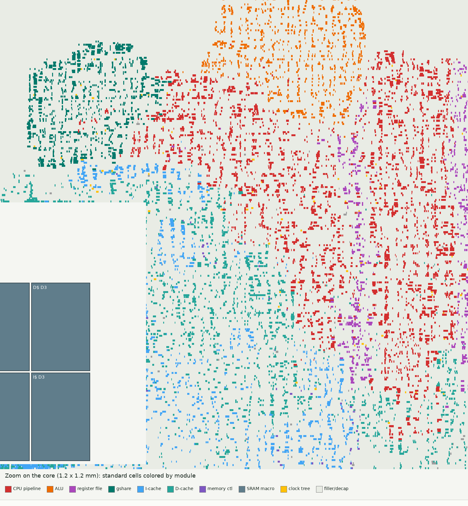
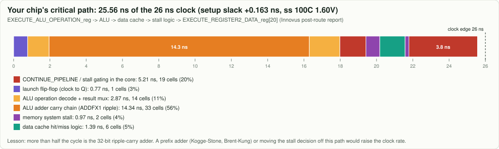

# 7. From RTL to silicon

The SystemVerilog in `src/` describes behaviour. Three tools turn it into a chip:

1. **Synthesis** maps the logic onto a library of *standard cells*: tiny pre-drawn gates.
2. **Place and route** puts every cell on the die and draws the metal wires between them.
3. **Sign-off** checks timing (is every path shorter than the clock period?) and the design rules.

## Standard cells are real drawings

These are actual SkyWater sky130 cells (open source, Apache 2.0). Red polysilicon crossing green
diffusion is a transistor; the purple rails at the top and bottom are power and ground.

| | |
|---|---|
|  |  |
|  |  |

The XOR is one bit of the gshare index; the flip-flop is one bit of a pipeline register (the 64-bit
core has thousands); the full adder is one bit of the ALU; the multiplexer is one bit of a
forwarding mux.

## A 32-bit prototype, placed and routed

This is an earlier 32-bit (RV32I) version of this pipeline, laid out on a 3 mm x 3 mm sky130 die.
The picture is rendered straight from its final layout file (DEF).

The register file (purple) is the biggest block: 31 x 32 flip-flops plus big read multiplexers.
The pipeline (red), ALU (orange) and gshare predictor (teal) cluster around it; the caches sit next
to their SRAM macros. See [SILICON.md](../SILICON.md) for the full die, the routing layers and the
reports.

## Timing: what limits the clock

The longest path (26 ns clock, +0.163 ns to spare) starts at the ALU's operation register, runs
through **33 full adders in a row** (a ripple-carry adder: each bit waits for the carry of the one
before), then into the data cache's hit logic and the stall logic. Over half the cycle is the adder.

## Area: what each feature costs

`make synth` maps every module of the 64-bit core onto sky130 cells. The gshare predictor at
different history lengths:

| history bits | counters | area (um2) | cells |
|---:|---:|---:|---:|
| 2 | 4 | 571 | 65 |
| **4 (baseline)** | 16 | 2,148 | 249 |
| 6 | 64 | 7,923 | 951 |
| 8 | 256 | 31,350 | 3,522 |
| 10 | 1,024 | 115,760 | 12,508 |

About 4x per 2 bits. Compare with chapter 5's accuracy chart: 6 bits gains a few percent of accuracy
for 3.7x the area.

## Same RTL, smaller transistors

`make timing` also maps the design onto **ASAP7**, a 7 nm-class research library: the same RTL whose
longest path is 5.5 ns on sky130 (130 nm) has a 0.73 ns path there, about 1.37 GHz. The process node
is a property of the factory, not of the Verilog; see [PERFORMANCE.md](../PERFORMANCE.md). That is the everyday trade-off of hardware design.

Next: [8. Using the CPU](08_using_the_cpu.md)
