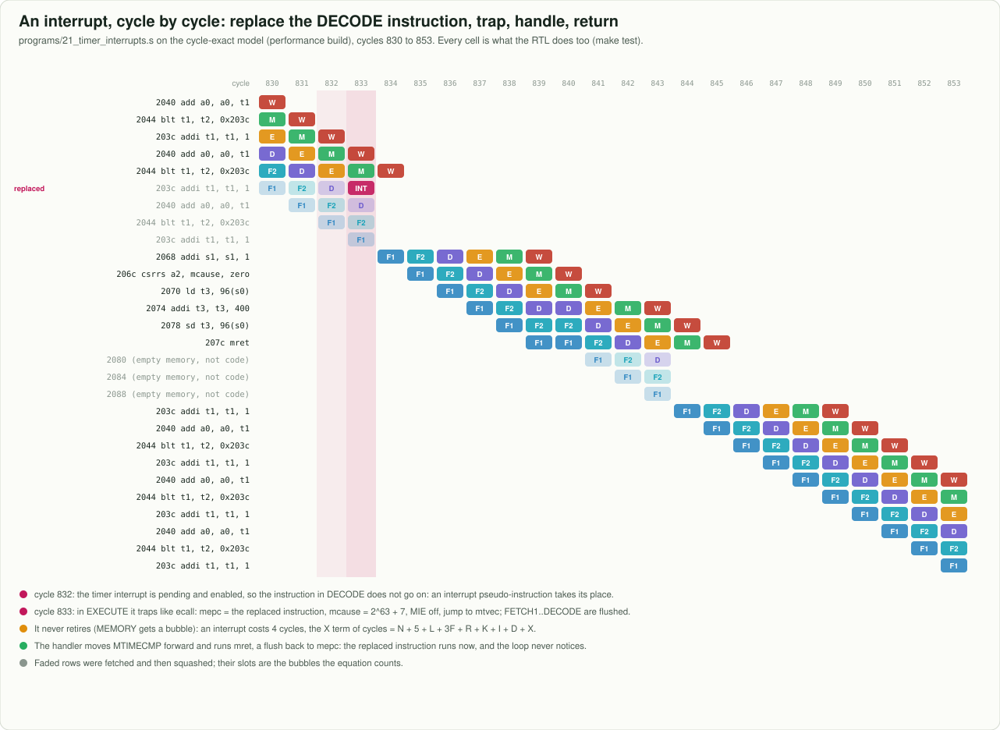
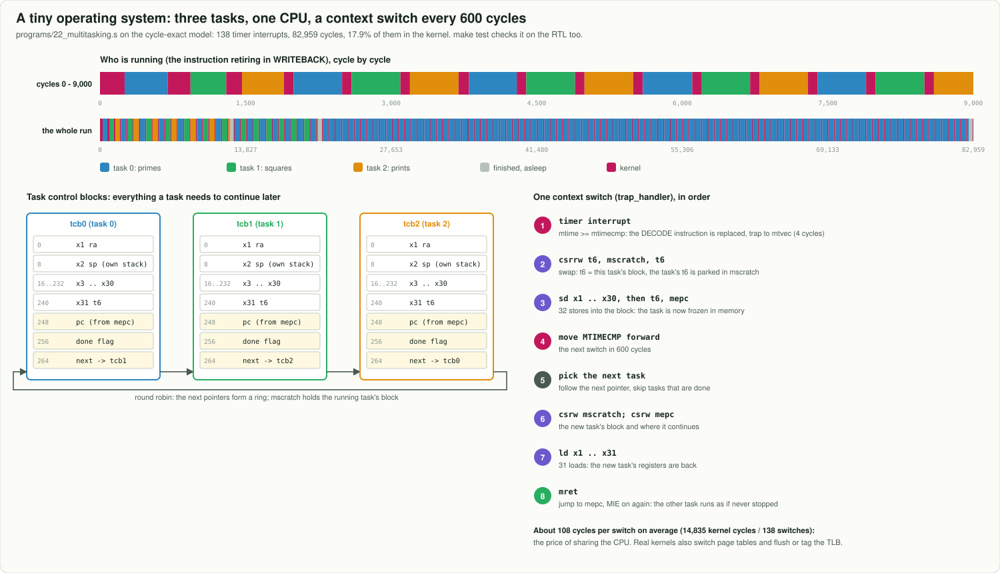

# 9. Devices, interrupts and booting: the CPU and the rest of the computer

A CPU on its own only computes. To print a character, light an LED or notice a key press, it has to reach
the other parts of the computer. This chapter covers the three ideas every computer uses for that:
memory-mapped devices, interrupts, and a boot sequence.

## Devices are addresses

There is no "print" instruction. A **device register** is an address that is not memory: a store to it
makes the device do something, and a load from it reads the device's state. In Sixfold, the 256 bytes
starting at `0x1000_0000` are the device page:

```asm
    li   s0, 0x10000000
    li   t0, 'A'
    sb   t0, 0(s0)          # PUTCHAR: the character goes out of the serial port
    li   t0, 0x81
    sd   t0, 8(s0)          # LEDS: the outer two LEDs light up
    ld   t1, 16(s0)         # BUTTONS: 1 bits for the buttons held down
```

The pipeline treats these as ordinary loads and stores. Only the address decides whether a store reaches
RAM or a device: `address[63:8] == 0x1000_00` in [`src/Riscv64_top.sv`](../../src/Riscv64_top.sv) (in
simulation) and [`fpga/rtl/Sixfold_System.sv`](../../fpga/rtl/Sixfold_System.sv) (on the FPGA). The
[memory map](../img/diagrams/memory_map.svg) lists every register.

One rule follows from this. **A load from a device must not change the device.** A load can execute more
than once: it repeats while the data cache fetches its line, or it can be squashed after a wrong branch
guess. So Sixfold's UART makes you *read* the received byte with a load, and *take* it with a separate
store.

## Polling and interrupts

A program can wait for a device by **polling**: loading its status register in a loop until something
changes. The boot firmware's `getc` does exactly that. Polling is simple, but the CPU can do nothing else
while it waits.

An **interrupt** reverses who asks. The device raises a line, and the CPU stops what it is doing between
two instructions and jumps to a handler. RISC-V defines the pieces:

| piece | what it does |
|---|---|
| `mtvec` | where the handler starts |
| `mie` | which interrupts may happen: bit 7 the timer, bit 11 external devices |
| `mstatus.MIE` | the global on/off switch; cleared automatically while a handler runs |
| `mip` | which interrupt lines are up right now |
| `mepc`, `mcause` | where the program was interrupted, and why (bit 63 set means an interrupt) |
| `mret` | return to `mepc` and turn interrupts back on |

Every RISC-V system has a **machine timer**: `MTIME` counts time, and the timer interrupt fires when it
reaches `MTIMECMP`. A handler that adds a fixed amount to `MTIMECMP` gets a steady tick. Operating
systems use that tick to switch between programs.

```bash
make run PROG=21_timer_interrupts     # 25 timer interrupts during a loop; the sum still comes out right
make pipe PROG=21_timer_interrupts    # find the flush with no branch behind it: that is an interrupt
```

## Precise interrupts in a pipeline

Six instructions are in flight at any moment, so "between two instructions" needs a definition. An
interrupt is **precise** if every instruction before the interrupted one has finished and none after it
has changed anything. Only then can `mret` simply resume.

Sixfold takes an interrupt in DECODE: the instruction there is set aside, and a pseudo-instruction carrying
its address goes to EXECUTE instead (`DECODE_TAKES_INTERRUPT` in [`src/Riscv64.sv`](../../src/Riscv64.sv)).
In EXECUTE the pseudo-instruction traps, exactly like `ecall`. The three older instructions in EXECUTE,
MEMORY and WRITEBACK finish normally, and the younger ones in FETCH1 and FETCH2 are flushed. The trap costs
4 cycles: a flush's 3, plus the pseudo-instruction's own slot, which never retires.



Out-of-order processors solve the same problem differently. Instructions finish in any order but *retire*
in program order through a reorder buffer, and an interrupt is taken at the retirement point. The
guarantee is the same.

## Sharing the CPU: a context switch

A timer interrupt is all an operating system needs to share one CPU between several programs.
[`programs/22_multitasking.s`](../../programs/22_multitasking.s) runs three tasks. Each timer interrupt
enters the kernel, and the kernel does the following:

1. It **saves** the interrupted task: all 31 registers and `mepc`, into that task's control block.
   `mscratch` holds the block's address, so the first register can be saved before any register is free.
2. It **chooses** the next task: round robin, skipping tasks that have finished.
3. It **restores** that task's registers, sets `mepc` to where that task was interrupted, and runs `mret`.

Each task sees only its own registers, its own stack and its own program counter, as if it had the CPU to
itself. The price is about 108 cycles per switch, 18% of this program's run.



```bash
make run PROG=22_multitasking          # task 2's lines appear while tasks 0 and 1 are still computing
```

## Booting

When a computer is switched on, its processor starts at a fixed **reset vector**. In a PC that address
points into firmware (BIOS or UEFI). The firmware sets up the hardware, finds the operating system,
copies it into memory and jumps to it. Sixfold on an FPGA does the same on a small scale, as described in
[FPGA.md](../FPGA.md#4-how-it-boots):

1. The reset vector is `0x0000`, where [`fpga/firmware/bios.s`](../../fpga/firmware/bios.s) sits in block
   RAM.
2. The firmware prints a banner and waits on the serial port.
3. Your PC sends a program. The firmware stores it at `0x2000`, byte by byte.
4. A store to the `BOOT` register restarts the core at `0x2000` with clean caches.
5. When the program writes `tohost`, the system returns to the firmware, which reports the result.

The [FPGA section of the site](../../index.html#fpga) runs this firmware in your browser. Try the
`interrupt_echo` program there: its main loop only sleeps, and all its work happens in the interrupt
handler.

## Try it

* In `programs/21_timer_interrupts.s`, halve `PERIOD`. How many ticks now, and how many cycles? Check the
  answer with `cycles = N + 5 + L + 3F + R + K + I + D + X` from [MATH.md](../MATH.md).
* Remove `csrci mstatus, 8` at the end, and make the handler never move `MTIMECMP` forward. What
  happens, and why does `wfi` not help?
* Write a handler that saves and restores the registers it uses on the stack, so that it could interrupt
  any program.

Back to the [learning path](README.md).
